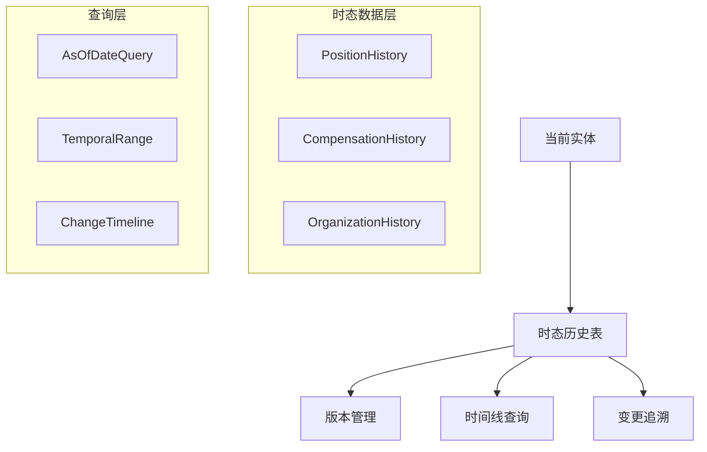

# 🕐 Cube Castle 时态模型实现方案

## 📋 **方案概述**

**目标**: 在现有员工模型基础上实现完整的时态数据管理能力  
**原则**: 不可变历史 + 时间线一致性 + 追溯支持 + 审计完整性  
**日期**: 2025年7月27日  

---

## 🎯 **时态模型设计架构**

### 核心设计理念



## 🏗️ **实施方案选择**

### 方案1: 基于现有Person实体的时态增强 ⭐ (推荐)

**优势**: 
- 最小改动现有架构
- 充分利用已完成的元合约编译器
- 与Temporal工作流天然集成

**实施策略**: 创建专门的历史表，保持主表为当前状态

#### 1.1 PositionHistory时态实体设计

```go
// internal/metacontract/position_history.yaml
specification_version: "6.0"
api_id: "550e8400-e29b-41d4-a716-446655440002"
namespace: "hr.employees"
resource_name: "position_history"
version: "1.0.0"

data_structure:
  fields:
    # 基础标识
    - name: "id"
      type: "uuid"
      required: true
      unique: true
      data_classification: "INTERNAL"
    
    - name: "tenant_id" 
      type: "uuid"
      required: true
      data_classification: "INTERNAL"
    
    # 关联实体
    - name: "employee_id"
      type: "uuid"
      required: true
      data_classification: "INTERNAL"
      
    # 职位信息快照
    - name: "position_title"
      type: "string"
      required: true
      max_length: 100
      data_classification: "INTERNAL"
    
    - name: "department"
      type: "string"
      required: true
      max_length: 100
      data_classification: "INTERNAL"
      
    - name: "job_level"
      type: "string"
      max_length: 50
      data_classification: "INTERNAL"
      
    - name: "location"
      type: "string"
      max_length: 100
      data_classification: "INTERNAL"
      
    - name: "employment_type"
      type: "enum"
      enum_values: ["FULL_TIME", "PART_TIME", "CONTRACT", "INTERN"]
      required: true
      data_classification: "INTERNAL"
    
    # 汇报关系
    - name: "reports_to_employee_id"
      type: "uuid"
      data_classification: "INTERNAL"
    
    # 时态字段 (核心)
    - name: "effective_date"
      type: "timestamp"
      required: true
      data_classification: "INTERNAL"
      validation_rules: ["future_date_allowed"]
      
    - name: "end_date"
      type: "timestamp"
      data_classification: "INTERNAL"
      description: "失效日期，当前记录为NULL"
      
    # 变更元数据
    - name: "change_reason"
      type: "string"
      max_length: 500
      data_classification: "INTERNAL"
      
    - name: "is_retroactive"
      type: "boolean"
      default: false
      data_classification: "INTERNAL"
      
    - name: "created_by"
      type: "uuid"
      required: true
      data_classification: "INTERNAL"
      
    - name: "created_at"
      type: "timestamp"
      required: true
      data_classification: "INTERNAL"
      
    # 薪酬范围信息 (可选)
    - name: "min_salary"
      type: "decimal"
      precision: 10
      scale: 2
      data_classification: "RESTRICTED"
      
    - name: "max_salary"
      type: "decimal"
      precision: 10
      scale: 2
      data_classification: "RESTRICTED"
      
    - name: "currency"
      type: "string"
      max_length: 3
      default: "CNY"
      data_classification: "INTERNAL"

  primary_key: "id"
  data_classification: "INTERNAL"

# 时态行为配置
temporal_behavior:
  temporality_paradigm: "TEMPORAL_TABLE"
  history_retention: "UNLIMITED"
  version_control: "IMMUTABLE_APPEND"
  change_detection: "FIELD_LEVEL"

# 关系定义
relationships:
  - relationship_id: "employee_position_history"
    type: "MANY_TO_ONE"
    source_entity: "position_history"
    target_entity: "person"
    source_field: "employee_id"
    target_field: "id"
    cascading_behavior: "NONE"
    
  - relationship_id: "manager_position_history"
    type: "MANY_TO_ONE" 
    source_entity: "position_history"
    target_entity: "person"
    source_field: "reports_to_employee_id"
    target_field: "id"
    cascading_behavior: "NONE"

# 安全模型
security_model:
  access_control: "RBAC"
  data_classification: "INTERNAL"
  tenant_isolation: "MANDATORY"
  field_level_security:
    - field: "min_salary"
      required_permission: "hr.compensation.read"
    - field: "max_salary" 
      required_permission: "hr.compensation.read"

# 持久化配置
persistence_profile:
  primary_store: "postgresql"
  indexed_in: ["postgresql", "neo4j"]
  graph_node_label: "PositionHistory"
  graph_edge_definitions:
    - "POSITION_HELD_BY -> Person"
    - "REPORTS_TO_POSITION -> PositionHistory"
    - "POSITION_IN_DEPARTMENT -> Organization"

compliance_tags: ["SOX", "AUDIT_TRAIL", "TEMPORAL_DATA"]
```

#### 1.2 生成的Ent Schema结构

使用元合约编译器生成：

```bash
# 生成时态实体
./metacontract-compiler compile \
  --input ./metacontract/position_history.yaml \
  --output ./generated/schema/
```

预期生成结果：

```go
// generated/schema/position_history.go
package schema

import (
    "entgo.io/ent"
    "entgo.io/ent/schema/field"
    "entgo.io/ent/schema/edge"
    "entgo.io/ent/schema/index"
    "github.com/gaogu/cube-castle/internal/ent/annotations"
)

type PositionHistory struct {
    ent.Schema
}

func (PositionHistory) Fields() []ent.Field {
    return []ent.Field{
        field.UUID("id").Unique().Immutable(),
        field.UUID("tenant_id").Immutable(),
        field.UUID("employee_id").Immutable(),
        
        // 职位信息快照
        field.String("position_title").NotEmpty().MaxLen(100),
        field.String("department").NotEmpty().MaxLen(100),
        field.String("job_level").Optional().MaxLen(50),
        field.String("location").Optional().MaxLen(100),
        field.Enum("employment_type").Values("FULL_TIME", "PART_TIME", "CONTRACT", "INTERN"),
        
        // 汇报关系
        field.UUID("reports_to_employee_id").Optional(),
        
        // 时态字段
        field.Time("effective_date").Immutable(),
        field.Time("end_date").Optional(),
        
        // 变更元数据
        field.String("change_reason").Optional().MaxLen(500),
        field.Bool("is_retroactive").Default(false),
        field.UUID("created_by").Immutable(),
        field.Time("created_at").Default(time.Now).Immutable(),
        
        // 薪酬信息
        field.Float("min_salary").Optional().Positive().
            Annotations(annotations.MetaContractAnnotation{
                DataClassification: "RESTRICTED",
                RequiredPermission: "hr.compensation.read",
            }),
        field.Float("max_salary").Optional().Positive().
            Annotations(annotations.MetaContractAnnotation{
                DataClassification: "RESTRICTED", 
                RequiredPermission: "hr.compensation.read",
            }),
        field.String("currency").Default("CNY").MaxLen(3),
    }
}

func (PositionHistory) Edges() []ent.Edge {
    return []ent.Edge{
        // 关联员工
        edge.From("employee", Person.Type).
            Ref("position_history").
            Field("employee_id").
            Required().
            Unique(),
            
        // 关联直接上级
        edge.From("reports_to", Person.Type).
            Ref("managed_positions").
            Field("reports_to_employee_id").
            Unique(),
    }
}

func (PositionHistory) Indexes() []ent.Index {
    return []ent.Index{
        // 租户+员工+时间范围查询优化
        index.Fields("tenant_id", "employee_id", "effective_date"),
        
        // 当前职位查询优化 (end_date为NULL)
        index.Fields("tenant_id", "employee_id").
            Where(sql.IsNull("end_date")),
            
        // 时间范围查询
        index.Fields("tenant_id", "effective_date", "end_date"),
        
        // 追溯变更查询
        index.Fields("tenant_id", "is_retroactive", "created_at"),
        
        // 汇报关系查询
        index.Fields("tenant_id", "reports_to_employee_id", "effective_date").
            Where(sql.IsNull("end_date")),
    }
}

// 实体钩子 - 时态一致性验证
func (PositionHistory) Hooks() []ent.Hook {
    return []ent.Hook{
        hook.On(
            func(next ent.Mutator) ent.Mutator {
                return ent.MutateFunc(func(ctx context.Context, m ent.Mutation) (ent.Value, error) {
                    if m.Op().Is(ent.OpCreate) {
                        // 验证时态一致性
                        if err := validateTemporalConsistency(ctx, m); err != nil {
                            return nil, err
                        }
                        
                        // 自动关闭之前的记录
                        if err := closePreviousPositionRecord(ctx, m); err != nil {
                            return nil, err
                        }
                    }
                    return next.Mutate(ctx, m)
                })
            },
            ent.OpCreate,
        ),
    }
}
```

#### 1.3 时态查询服务实现

```go
// internal/service/temporal_query_service.go
package service

import (
    "context"
    "fmt"
    "time"
    
    "github.com/google/uuid"
    "github.com/gaogu/cube-castle/ent"
    "github.com/gaogu/cube-castle/ent/positionhistory"
)

type TemporalQueryService struct {
    client *ent.Client
}

// GetPositionAsOfDate 获取指定日期的职位信息
func (s *TemporalQueryService) GetPositionAsOfDate(
    ctx context.Context,
    tenantID, employeeID uuid.UUID,
    asOfDate time.Time,
) (*PositionSnapshot, error) {
    
    position, err := s.client.PositionHistory.Query().
        Where(
            positionhistory.TenantIDEQ(tenantID),
            positionhistory.EmployeeIDEQ(employeeID),
            positionhistory.EffectiveDateLTE(asOfDate),
            positionhistory.Or(
                positionhistory.EndDateIsNil(),
                positionhistory.EndDateGT(asOfDate),
            ),
        ).
        Order(ent.Desc(positionhistory.FieldEffectiveDate)).
        First(ctx)
    
    if err != nil {
        if ent.IsNotFound(err) {
            return nil, fmt.Errorf("no position found for employee %s at date %s", 
                employeeID, asOfDate.Format("2006-01-02"))
        }
        return nil, err
    }
    
    return &PositionSnapshot{
        PositionHistoryID: position.ID,
        EmployeeID:        position.EmployeeID,
        PositionTitle:     position.PositionTitle,
        Department:        position.Department,
        JobLevel:          position.JobLevel,
        Location:          position.Location,
        EmploymentType:    position.EmploymentType,
        ReportsToID:       position.ReportsToEmployeeID,
        EffectiveDate:     position.EffectiveDate,
        EndDate:           position.EndDate,
        IsRetroactive:     position.IsRetroactive,
    }, nil
}

// GetPositionTimeline 获取员工完整职位时间线
func (s *TemporalQueryService) GetPositionTimeline(
    ctx context.Context,
    tenantID, employeeID uuid.UUID,
    fromDate, toDate *time.Time,
) ([]*PositionSnapshot, error) {
    
    query := s.client.PositionHistory.Query().
        Where(
            positionhistory.TenantIDEQ(tenantID),
            positionhistory.EmployeeIDEQ(employeeID),
        )
    
    if fromDate != nil {
        query = query.Where(
            positionhistory.Or(
                positionhistory.EndDateIsNil(),
                positionhistory.EndDateGTE(*fromDate),
            ),
        )
    }
    
    if toDate != nil {
        query = query.Where(positionhistory.EffectiveDateLTE(*toDate))
    }
    
    positions, err := query.
        Order(ent.Asc(positionhistory.FieldEffectiveDate)).
        All(ctx)
    
    if err != nil {
        return nil, err
    }
    
    snapshots := make([]*PositionSnapshot, len(positions))
    for i, pos := range positions {
        snapshots[i] = &PositionSnapshot{
            PositionHistoryID: pos.ID,
            EmployeeID:        pos.EmployeeID,
            PositionTitle:     pos.PositionTitle,
            Department:        pos.Department,
            JobLevel:          pos.JobLevel,
            Location:          pos.Location,
            EmploymentType:    pos.EmploymentType,
            ReportsToID:       pos.ReportsToEmployeeID,
            EffectiveDate:     pos.EffectiveDate,
            EndDate:           pos.EndDate,
            IsRetroactive:     pos.IsRetroactive,
        }
    }
    
    return snapshots, nil
}

// ValidateTemporalConsistency 验证时态一致性
func (s *TemporalQueryService) ValidateTemporalConsistency(
    ctx context.Context,
    tenantID, employeeID uuid.UUID,
    newEffectiveDate time.Time,
) error {
    
    // 检查是否与现有记录冲突
    conflictCount, err := s.client.PositionHistory.Query().
        Where(
            positionhistory.TenantIDEQ(tenantID),
            positionhistory.EmployeeIDEQ(employeeID),
            positionhistory.EffectiveDateLTE(newEffectiveDate),
            positionhistory.Or(
                positionhistory.EndDateIsNil(),
                positionhistory.EndDateGT(newEffectiveDate),
            ),
        ).
        Count(ctx)
    
    if err != nil {
        return err
    }
    
    if conflictCount > 0 {
        return fmt.Errorf("temporal conflict: position already exists for employee %s at date %s", 
            employeeID, newEffectiveDate.Format("2006-01-02"))
    }
    
    return nil
}

type PositionSnapshot struct {
    PositionHistoryID uuid.UUID  `json:"position_history_id"`
    EmployeeID        uuid.UUID  `json:"employee_id"`
    PositionTitle     string     `json:"position_title"`
    Department        string     `json:"department"`
    JobLevel          string     `json:"job_level"`
    Location          string     `json:"location"`
    EmploymentType    string     `json:"employment_type"`
    ReportsToID       *uuid.UUID `json:"reports_to_id,omitempty"`
    EffectiveDate     time.Time  `json:"effective_date"`
    EndDate           *time.Time `json:"end_date,omitempty"`
    IsRetroactive     bool       `json:"is_retroactive"`
}
```

#### 1.4 Temporal工作流集成

```go
// internal/workflow/position_change_workflow.go
package workflow

import (
    "time"
    "go.temporal.io/sdk/workflow"
)

// PositionChangeWorkflow 职位变更工作流
func PositionChangeWorkflow(ctx workflow.Context, req PositionChangeRequest) (*PositionChangeResult, error) {
    logger := workflow.GetLogger(ctx)
    
    // 设置活动选项
    activityOptions := workflow.ActivityOptions{
        StartToCloseTimeout: time.Minute * 5,
        RetryPolicy: &temporal.RetryPolicy{
            InitialInterval:    time.Second * 10,
            BackoffCoefficient: 2.0,
            MaximumInterval:    time.Minute * 2,
            MaximumAttempts:    3,
        },
    }
    ctx = workflow.WithActivityOptions(ctx, activityOptions)
    
    // 阶段1: 验证时态一致性
    var validationResult TemporalValidationResult
    err := workflow.ExecuteActivity(ctx,
        "ValidateTemporalConsistencyActivity",
        ValidateTemporalConsistencyRequest{
            TenantID:      req.TenantID,
            EmployeeID:    req.EmployeeID,
            EffectiveDate: req.EffectiveDate,
        }).Get(ctx, &validationResult)
    
    if err != nil || !validationResult.IsValid {
        return &PositionChangeResult{
            Success: false,
            Error:   validationResult.ErrorMessage,
        }, err
    }
    
    // 阶段2: 处理时间线逻辑
    isRetroactive := req.EffectiveDate.Before(workflow.Now(ctx))
    
    if isRetroactive {
        logger.Info("Processing retroactive position change")
        
        // 处理追溯变更 - 可能需要重算下游数据
        var retroResult RetroactiveProcessingResult
        err = workflow.ExecuteActivity(ctx,
            "ProcessRetroactivePositionChangeActivity",
            ProcessRetroactiveRequest{
                TenantID:      req.TenantID,
                EmployeeID:    req.EmployeeID,
                EffectiveDate: req.EffectiveDate,
                NewPosition:   req.NewPosition,
            }).Get(ctx, &retroResult)
        
        if err != nil {
            return &PositionChangeResult{
                Success: false,
                Error:   "Retroactive processing failed: " + err.Error(),
            }, err
        }
        
        // 如果需要触发下游重算
        if retroResult.RequiresRecalculation {
            workflow.ExecuteChildWorkflow(
                workflow.WithChildOptions(ctx, workflow.ChildWorkflowOptions{
                    WorkflowID: fmt.Sprintf("payroll-recalc-%s-%d", 
                        req.EmployeeID.String(), 
                        req.EffectiveDate.Unix()),
                }),
                "PayrollRecalculationWorkflow",
                PayrollRecalculationRequest{
                    TenantID:      req.TenantID,
                    EmployeeID:    req.EmployeeID,
                    EffectiveDate: req.EffectiveDate,
                },
            )
        }
    }
    
    // 阶段3: 创建时态历史记录
    var historyResult CreatePositionHistoryResult
    err = workflow.ExecuteActivity(ctx,
        "CreatePositionHistoryActivity",
        CreatePositionHistoryRequest{
            TenantID:        req.TenantID,
            EmployeeID:      req.EmployeeID,
            PositionData:    req.NewPosition,
            EffectiveDate:   req.EffectiveDate,
            ChangeReason:    req.ChangeReason,
            CreatedBy:       req.RequestedBy,
            IsRetroactive:   isRetroactive,
        }).Get(ctx, &historyResult)
    
    if err != nil {
        return &PositionChangeResult{
            Success: false,
            Error:   "Position history creation failed: " + err.Error(),
        }, err
    }
    
    // 阶段4: 更新Neo4j图数据 (通过事务性发件箱)
    err = workflow.ExecuteActivity(ctx,
        "PublishPositionChangeEventActivity",
        PublishEventRequest{
            EventType: "HR.Position.Changed",
            TenantID:  req.TenantID,
            Payload: PositionChangedPayload{
                EmployeeID:        req.EmployeeID,
                PositionHistoryID: historyResult.ID,
                EffectiveDate:     req.EffectiveDate,
                IsRetroactive:     isRetroactive,
            },
        }).Get(ctx, nil)
    
    if err != nil {
        logger.Error("Failed to publish position change event", "error", err)
        // 不中断主流程，但记录错误
    }
    
    return &PositionChangeResult{
        Success:           true,
        PositionHistoryID: historyResult.ID,
        EffectiveDate:     req.EffectiveDate,
        IsRetroactive:     isRetroactive,
        ProcessedAt:       workflow.Now(ctx),
    }, nil
}
```

## 📊 **实施计划**

### 第一周 (7月28日 - 8月3日)

**Day 1-2: 元合约定义与编译**
```bash
# 任务清单
□ 创建 position_history.yaml 元合约定义
□ 运行元合约编译器生成Ent Schema
□ 验证生成的代码质量
□ 创建数据库迁移脚本
```

**Day 3-4: 时态查询服务实现**
```bash
# 任务清单  
□ 实现 TemporalQueryService
□ 编写时态一致性验证逻辑
□ 实现 AsOfDate 查询功能
□ 编写单元测试
```

**Day 5: Temporal工作流集成**
```bash
# 任务清单
□ 实现 PositionChangeWorkflow 
□ 创建时态相关Activities
□ 集成事务性发件箱
□ 端到端测试
```

### 验收标准

**功能验收**:
- ✅ 支持任意历史时点查询
- ✅ 追溯变更数据一致性保证
- ✅ 时间线查询性能 <200ms
- ✅ 并发变更冲突检测

**质量验收**:
- ✅ 单元测试覆盖率 >95%
- ✅ 集成测试通过
- ✅ 性能测试达标
- ✅ 安全审计通过

## 🔧 **技术细节**

### 数据库迁移脚本

```sql
-- migrations/202507XX_create_position_history.sql

-- 创建职位历史表
CREATE TABLE position_history (
    id UUID PRIMARY KEY DEFAULT gen_random_uuid(),
    tenant_id UUID NOT NULL,
    employee_id UUID NOT NULL,
    
    -- 职位信息快照
    position_title VARCHAR(100) NOT NULL,
    department VARCHAR(100) NOT NULL,
    job_level VARCHAR(50),
    location VARCHAR(100),
    employment_type VARCHAR(20) NOT NULL CHECK (employment_type IN ('FULL_TIME', 'PART_TIME', 'CONTRACT', 'INTERN')),
    
    -- 汇报关系
    reports_to_employee_id UUID,
    
    -- 时态字段
    effective_date TIMESTAMP WITH TIME ZONE NOT NULL,
    end_date TIMESTAMP WITH TIME ZONE,
    
    -- 变更元数据
    change_reason TEXT,
    is_retroactive BOOLEAN DEFAULT FALSE,
    created_by UUID NOT NULL,
    created_at TIMESTAMP WITH TIME ZONE DEFAULT NOW(),
    
    -- 薪酬范围
    min_salary DECIMAL(10,2),
    max_salary DECIMAL(10,2),
    currency CHAR(3) DEFAULT 'CNY',
    
    -- 约束
    CONSTRAINT valid_date_range CHECK (end_date IS NULL OR end_date > effective_date),
    CONSTRAINT valid_salary_range CHECK (max_salary IS NULL OR min_salary IS NULL OR max_salary >= min_salary)
);

-- 创建索引
CREATE INDEX idx_position_history_temporal 
ON position_history (tenant_id, employee_id, effective_date, end_date);

CREATE UNIQUE INDEX idx_position_history_current 
ON position_history (tenant_id, employee_id) 
WHERE end_date IS NULL;

CREATE INDEX idx_position_history_retroactive 
ON position_history (tenant_id, is_retroactive, created_at);

CREATE INDEX idx_position_history_reports_to 
ON position_history (tenant_id, reports_to_employee_id, effective_date)
WHERE end_date IS NULL;

-- 外键约束
ALTER TABLE position_history 
ADD CONSTRAINT fk_position_history_employee 
FOREIGN KEY (tenant_id, employee_id) REFERENCES person(tenant_id, id);

ALTER TABLE position_history 
ADD CONSTRAINT fk_position_history_reports_to 
FOREIGN KEY (tenant_id, reports_to_employee_id) REFERENCES person(tenant_id, id);

-- 行级安全策略
ALTER TABLE position_history ENABLE ROW LEVEL SECURITY;

CREATE POLICY position_history_tenant_isolation ON position_history
    FOR ALL TO application_role
    USING (tenant_id = current_setting('app.current_tenant_id')::UUID);
```

### 配置更新

```yaml
# config/temporal_model.yaml
temporal_model:
  position_history:
    max_history_per_employee: 1000
    retention_period: "10y"
    retroactive_change_limit: "1y"
    
  query_optimization:
    cache_current_positions: true
    cache_ttl: "5m"
    max_timeline_range: "5y"
    
  validation:
    strict_temporal_consistency: true
    allow_future_dates: true
    max_future_date: "2y"
```

---

## 🎯 **总结**

**时态模型实现方案**采用基于现有Person实体的增强策略，通过创建专门的PositionHistory时态表来实现：

**核心优势**:
1. **最小架构改动** - 充分利用已有基础设施
2. **元合约驱动** - 利用已完成的编译器自动生成代码
3. **Temporal集成** - 与工作流引擎天然集成
4. **企业级特性** - 支持追溯、审计、权限控制

**立即执行**:
- 📅 **本周开始**: 创建position_history.yaml元合约
- 🔧 **本周完成**: 时态查询服务实现
- ✅ **下周验收**: 完整时态功能测试

此方案将为Cube Castle员工模型提供企业级的时态数据管理能力，成为第二阶段开发的重要基石。

*方案设计 - SuperClaude Framework | 2025-07-27*