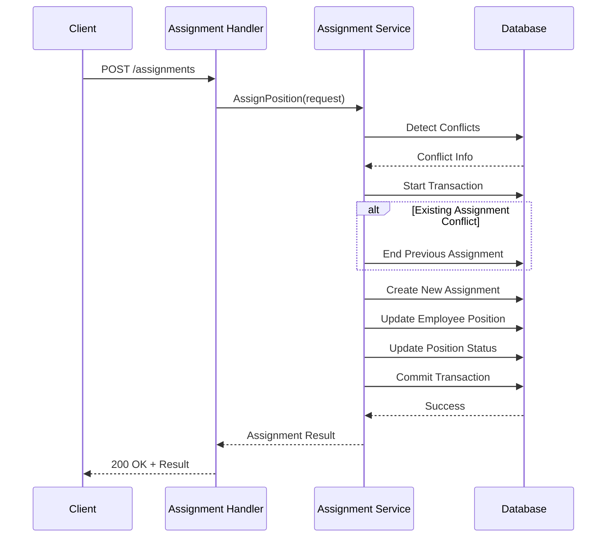
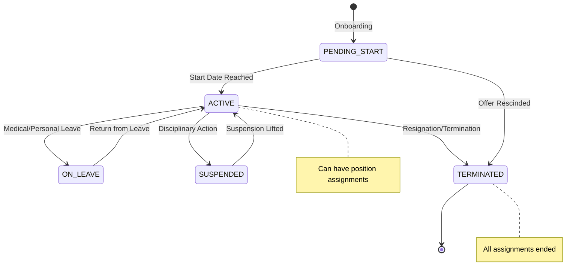

# Advanced Features Architecture Design | 高级功能架构设计

**Last Updated**: 2025-07-31 15:15:00  
**Version**: v1.5.0  
**Phase**: Week 3 Implementation  

## 📋 Overview | 概述

This document outlines the architectural design and implementation of advanced employee management features in Week 3, including intelligent position assignment, comprehensive employee lifecycle management, and sophisticated analytics capabilities.

本文档概述了第三周高级员工管理功能的架构设计和实现，包括智能岗位分配、综合员工生命周期管理和复杂的分析功能。

## 🏗️ System Architecture | 系统架构

### High-Level Architecture | 高层架构

```
┌─────────────────────────────────────────────────────────────┐
│                    HTTP API Layer | HTTP API层                │
├─────────────────────────────────────────────────────────────┤
│  /assignments/*  │ /lifecycle/*  │  /analytics/*         │
│  Position Mgmt   │ Employee LC   │  Reporting & Queries   │
└─────────────────────────────────────────────────────────────┘
                            │
┌─────────────────────────────────────────────────────────────┐
│                Service Layer | 服务层                        │
├─────────────────────────────────────────────────────────────┤
│ PositionAssignment │ EmployeeLifecycle │ Analytics         │
│ Service            │ Service           │ Service           │
│                    │                   │                   │
│ • Assignment Logic │ • Onboarding      │ • Metrics         │
│ • Conflict Resolution│• Offboarding    │ • History Queries │
│ • Transfer Management│• Promotions     │ • Trend Analysis  │
│ • Transaction Safety│ • Status Changes │ • Reporting       │
└─────────────────────────────────────────────────────────────┘
                            │
┌─────────────────────────────────────────────────────────────┐
│                  Data Layer | 数据层                          │
├─────────────────────────────────────────────────────────────┤
│  Employee  │  Position  │  PositionOccupancyHistory        │
│   Entity   │   Entity   │         Entity                   │
│            │            │                                  │
│ • Core Info│ • Job Spec │ • Assignment Records             │
│ • Status   │ • Status   │ • Time Tracking                  │
│ • Current  │ • Capacity │ • Relationship History           │
│   Position │            │ • Business Context               │
└─────────────────────────────────────────────────────────────┘
```

## 🔧 Service Layer Design | 服务层设计

### 1. PositionAssignmentService | 岗位分配服务

**Purpose**: Intelligent position assignment with conflict resolution and transaction safety
**目的**: 具有冲突解决和事务安全的智能岗位分配

#### Core Capabilities | 核心功能
```go
type PositionAssignmentService struct {
    client *ent.Client
    logger *logging.StructuredLogger
}

// Primary Operations | 主要操作
- AssignPosition(ctx, tenantID, AssignmentRequest) *AssignmentResult
- TransferEmployee(ctx, tenantID, TransferRequest) *AssignmentResult  
- EndAssignment(ctx, tenantID, employeeID, endDate, reason) error
- GetActiveAssignments(ctx, tenantID) []*PositionOccupancyHistory
```

#### Intelligent Conflict Resolution | 智能冲突解决
```go
type ConflictInfo struct {
    Type            string      // EXISTING_ASSIGNMENT, POSITION_FILLED
    ConflictingItem interface{} // The conflicting entity
    Resolution      string      // Auto-resolution strategy
    Details         map[string]interface{}
}

// Conflict Detection Process | 冲突检测流程
1. Employee Status Validation | 员工状态验证
2. Position Availability Check | 岗位可用性检查  
3. Existing Assignment Detection | 现有分配检测
4. Capacity Conflict Analysis | 容量冲突分析
5. Auto-Resolution Strategy | 自动解决策略
```

#### Transaction-Safe Operations | 事务安全操作
- **Atomic Assignments** | 原子分配: All assignment operations in single transaction
- **Rollback on Failure** | 失败回滚: Complete rollback if any step fails
- **Consistency Guarantees** | 一致性保证: Employee-Position relationships always consistent
- **Conflict-Free Updates** | 无冲突更新: Intelligent handling of concurrent modifications

### 2. EmployeeLifecycleService | 员工生命周期服务

**Purpose**: Complete employee lifecycle management from hire to termination
**目的**: 从入职到离职的完整员工生命周期管理

#### Lifecycle Stages | 生命周期阶段
```go
type EmployeeLifecycleService struct {
    client               *ent.Client
    logger               *logging.StructuredLogger
    positionAssignmentSvc *PositionAssignmentService
}

// Lifecycle Operations | 生命周期操作
- OnboardEmployee(ctx, tenantID, OnboardingRequest) *OnboardingResult
- OffboardEmployee(ctx, tenantID, OffboardingRequest) error
- PromoteEmployee(ctx, tenantID, PromotionRequest) *AssignmentResult
- ChangeEmploymentStatus(ctx, tenantID, StatusChangeRequest) error
```

#### Onboarding Process | 入职流程
```mermaid
graph TD
    A[Validate Employee Details | 验证员工详情] --> B[Create Employee Record | 创建员工记录]
    B --> C{Initial Position? | 初始岗位?}
    C -->|Yes| D[Create Position Assignment | 创建岗位分配]
    C -->|No| E[Set PENDING_START Status | 设置待入职状态]
    D --> F[Update Employee Current Position | 更新员工当前岗位]
    E --> G[Record Onboarding Event | 记录入职事件]
    F --> G
    G --> H[Transaction Commit | 事务提交]
```

#### Offboarding Process | 离职流程
```mermaid
graph TD
    A[Fetch Employee Record | 获取员工记录] --> B[Find Active Assignments | 查找活跃分配]
    B --> C[End All Assignments | 结束所有分配]
    C --> D[Update Position Status to OPEN | 更新岗位状态为空缺]
    D --> E[Set Employee Status to TERMINATED | 设置员工状态为已离职]
    E --> F[Record Termination Details | 记录离职详情]
    F --> G[Clear Current Position | 清除当前岗位]
    G --> H[Record Offboarding Event | 记录离职事件]
```

### 3. AnalyticsService | 分析服务

**Purpose**: Comprehensive organizational analytics and historical reporting
**目的**: 综合组织分析和历史报告

#### Analytics Capabilities | 分析功能
```go
type AnalyticsService struct {
    client *ent.Client
    logger *logging.StructuredLogger
}

// Analytics Operations | 分析操作
- GetOrganizationalMetrics(ctx, tenantID) *OrganizationalMetrics
- GetEmployeeHistory(ctx, tenantID, employeeID) *EmployeeHistoryRecord
- GetPositionHistory(ctx, tenantID, positionID) *PositionHistoryRecord
- GetHistoricalAssignments(ctx, tenantID, params) []*PositionOccupancyHistory
```

#### Metrics Categories | 指标类别

**Organizational Metrics | 组织指标**:
- Employee counts by type, status | 按类型、状态统计员工数量
- Position utilization rates | 岗位利用率
- Average assignment duration | 平均分配时长
- Turnover analysis | 离职率分析

**Turnover Metrics | 离职指标**:
```go
type TurnoverMetrics struct {
    TerminationsThisMonth    int     // 本月离职人数
    TerminationsThisQuarter  int     // 本季度离职人数  
    TerminationsThisYear     int     // 本年度离职人数
    HiresThisMonth          int     // 本月入职人数
    HiresThisQuarter        int     // 本季度入职人数
    HiresThisYear           int     // 本年度入职人数
    MonthlyTurnoverRate     float64 // 月离职率
    QuarterlyTurnoverRate   float64 // 季度离职率
    AnnualTurnoverRate      float64 // 年离职率
}
```

**Assignment Metrics | 分配指标**:
```go
type AssignmentMetrics struct {
    TotalAssignments        int                    // 总分配数
    ActiveAssignments       int                    // 活跃分配数
    AssignmentsByType       map[string]int         // 按类型分配统计
    AverageAssignmentLength float64                // 平均分配时长
    PromotionsThisYear      int                    // 本年度晋升数
    TransfersThisYear       int                    // 本年度调转数
    AssignmentTrends        []AssignmentTrendPoint // 分配趋势
}
```

## 📊 Data Model Enhancements | 数据模型增强

### Enhanced Entity Relationships | 增强的实体关系

```go
// Employee Entity Enhancements | 员工实体增强
type Employee struct {
    // ... existing fields | 现有字段
    CurrentPositionID   *uuid.UUID              // 当前岗位ID
    EmploymentStatus    employee.EmploymentStatus // 雇佣状态
    HireDate           time.Time               // 入职日期
    TerminationDate    *time.Time              // 离职日期
    EmployeeDetails    map[string]interface{}  // 员工详情JSON
    
    // Relations | 关系
    CurrentPosition    *Position               // 当前岗位
    AssignmentHistory  []*PositionOccupancyHistory // 分配历史
}

// Position Entity Enhancements | 岗位实体增强  
type Position struct {
    // ... existing fields | 现有字段
    Status             position.Status         // 岗位状态
    PositionType       position.PositionType   // 岗位类型
    MaxOccupancy       int                    // 最大容量
    RequiredSkills     []string               // 必需技能
    
    // Relations | 关系
    OccupancyHistory   []*PositionOccupancyHistory // 占用历史
    CurrentOccupants   []*Employee            // 当前占用者
}

// PositionOccupancyHistory Enhanced | 岗位占用历史增强
type PositionOccupancyHistory struct {
    // Core Assignment Info | 核心分配信息
    ID                 uuid.UUID              // 分配ID
    TenantID           uuid.UUID              // 租户ID
    EmployeeID         uuid.UUID              // 员工ID
    PositionID         uuid.UUID              // 岗位ID
    
    // Time Tracking | 时间跟踪
    StartDate          time.Time              // 开始日期
    EndDate            *time.Time             // 结束日期
    IsActive           bool                   // 是否活跃
    
    // Assignment Context | 分配上下文
    AssignmentType     AssignmentType         // 分配类型
    AssignmentReason   string                 // 分配原因
    FtePercentage      float64               // FTE百分比
    WorkArrangement    WorkArrangement        // 工作安排
    
    // Approval & Audit | 审批与审计
    ApprovedBy         uuid.UUID              // 审批人
    ApprovalDate       time.Time              // 审批日期
    CreatedAt          time.Time              // 创建时间
    UpdatedAt          time.Time              // 更新时间
}
```

### Enum Definitions | 枚举定义

```go
// Employment Status | 雇佣状态
type EmploymentStatus string
const (
    EmploymentStatusACTIVE        EmploymentStatus = "ACTIVE"
    EmploymentStatusON_LEAVE      EmploymentStatus = "ON_LEAVE" 
    EmploymentStatusTERMINATED    EmploymentStatus = "TERMINATED"
    EmploymentStatusSUSPENDED     EmploymentStatus = "SUSPENDED"
    EmploymentStatusPENDING_START EmploymentStatus = "PENDING_START"
)

// Assignment Type | 分配类型
type AssignmentType string
const (
    AssignmentTypeREGULAR     AssignmentType = "REGULAR"
    AssignmentTypeINTERIM     AssignmentType = "INTERIM"
    AssignmentTypeACTING      AssignmentType = "ACTING"
    AssignmentTypeTEMPORARY   AssignmentType = "TEMPORARY"
    AssignmentTypeSECONDMENT  AssignmentType = "SECONDMENT"
)

// Work Arrangement | 工作安排
type WorkArrangement string
const (
    WorkArrangementON_SITE WorkArrangement = "ON_SITE"
    WorkArrangementREMOTE  WorkArrangement = "REMOTE"
    WorkArrangementHYBRID  WorkArrangement = "HYBRID"
)
```

## 🔄 Business Logic Flow | 业务逻辑流程

### Position Assignment Flow | 岗位分配流程



### Employee Lifecycle Flow | 员工生命周期流程



## 🚀 Performance Optimizations | 性能优化

### Database Query Optimization | 数据库查询优化

**Indexes | 索引**:
```sql
-- Assignment lookup optimization | 分配查询优化
CREATE INDEX idx_position_occupancy_employee_active 
ON position_occupancy_history(employee_id, tenant_id, is_active);

CREATE INDEX idx_position_occupancy_position_active
ON position_occupancy_history(position_id, tenant_id, is_active);

-- Analytics query optimization | 分析查询优化  
CREATE INDEX idx_position_occupancy_start_date
ON position_occupancy_history(tenant_id, start_date);

CREATE INDEX idx_employee_hire_termination_dates
ON employees(tenant_id, hire_date, termination_date);
```

**Query Patterns | 查询模式**:
- **Batch Operations** | 批量操作: Multiple assignments in single transaction
- **Eager Loading** | 预加载: Load related entities to reduce N+1 queries
- **Pagination** | 分页: Large result sets automatically paginated
- **Caching Strategy** | 缓存策略: Analytics results cached for 15 minutes

### Transaction Management | 事务管理

**Transaction Boundaries | 事务边界**:
- **Assignment Operations** | 分配操作: Single transaction per assignment
- **Lifecycle Events** | 生命周期事件: Complete lifecycle change in one transaction
- **Conflict Resolution** | 冲突解决: Conflict detection and resolution in same transaction
- **Rollback Strategy** | 回滚策略: Complete rollback on any operation failure

## 🔒 Security Considerations | 安全考虑

### Access Control | 访问控制

**Role-Based Permissions | 基于角色的权限**:
```go
// HR Manager - Full Access | HR经理 - 完全访问权限
- Create/Read/Update/Delete all employees and positions
- Execute all lifecycle operations
- Access all analytics and reports

// Manager - Team Access | 经理 - 团队访问权限  
- Read team member information
- Request position assignments for team
- Access team analytics

// Employee - Self Access | 员工 - 自身访问权限
- Read own employment information
- View own assignment history
- Access own analytics data
```

### Data Privacy | 数据隐私

**Tenant Isolation | 租户隔离**:
- All operations require tenant context
- Data queries filtered by tenant_id
- Cross-tenant data access prohibited

**Audit Trail | 审计轨迹**:
- All lifecycle events logged
- Assignment changes tracked with approval chain
- User actions recorded for compliance

## 📈 Monitoring & Observability | 监控与可观察性

### Key Metrics | 关键指标

**System Performance | 系统性能**:
- Assignment operation latency | 分配操作延迟
- Transaction success rate | 事务成功率
- Database connection pool utilization | 数据库连接池利用率
- Query execution time | 查询执行时间

**Business Metrics | 业务指标**:
- Daily assignment operations | 每日分配操作数
- Employee lifecycle events | 员工生命周期事件数
- Analytics query frequency | 分析查询频率
- Error rates by operation type | 按操作类型的错误率

### Logging Strategy | 日志策略

**Structured Logging | 结构化日志**:
```go
logger.Info("Position assignment completed",
    "assignment_id", result.AssignmentID,
    "employee_id", req.EmployeeID, 
    "position_id", req.PositionID,
    "assignment_type", req.AssignmentType,
    "tenant_id", tenantID,
)
```

**Error Logging | 错误日志**:
- Detailed error context for debugging
- Stack traces for system errors  
- Business rule violations logged separately
- Performance issues tracked with metrics

## 🔄 Future Enhancements | 未来增强

### Planned Features | 计划功能

**Phase 4 - Workflow Integration | 第四阶段 - 工作流集成**:
- Approval workflows for assignments and lifecycle events
- Automated position recommendations based on skills
- Integration with external HR systems
- Advanced reporting and dashboard capabilities

**Performance Scaling | 性能扩展**:
- Read replicas for analytics queries
- Caching layer for frequently accessed data
- Event-driven architecture for real-time updates
- Microservice decomposition for high-scale deployments

## 📚 Related Documentation | 相关文档

- [Database Schema Design](database_schema_week3.md)
- [API Endpoint Documentation](../api/advanced_employee_management_endpoints.md)
- [Implementation Report](../reports/week3_implementation_report.md)
- [Testing Strategy](../troubleshooting/advanced_features_testing.md)

---

**Next Review**: 2025-08-31 15:15:00