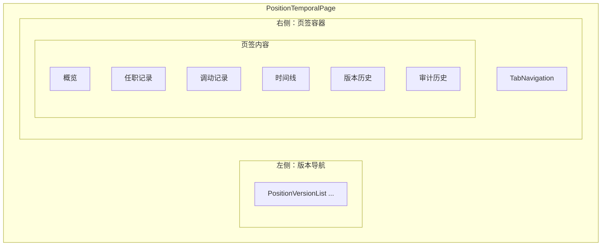
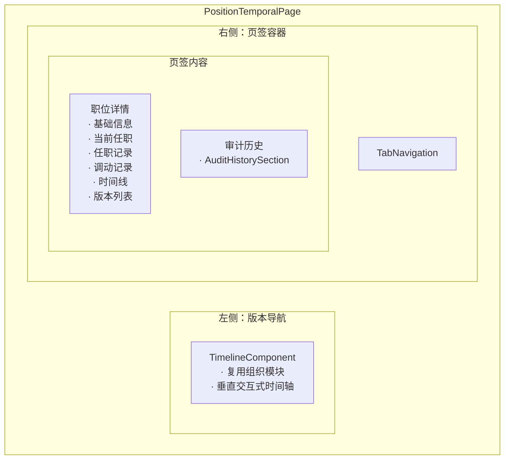

# 94号文档：93号《职位详情多页签体验方案》评审报告

**版本**: v1.0
**评审日期**: 2025-10-20
**评审人**: 架构组 · Claude Code
**评审对象**: 93号《职位详情多页签体验方案》v0.1
**关联计划**: 88号《职位管理前端功能差距分析》、80号《Position Management with Temporal Tracking》、06号《集成团队协作进展日志》
**评审结论**: ❌ **不推荐通过，需大幅修订**
**遵循原则**: CLAUDE.md 资源唯一性与跨层一致性原则（最高优先级）

---

## 目录

1. [评审范围与方法](#1-评审范围与方法)
2. [与88号、80号计划的对齐程度分析](#2-与8880号计划的对齐程度分析)
3. [方案质量与架构合理性分析](#3-方案质量与架构合理性分析)
4. [过度设计与重复造轮子问题识别](#4-过度设计与重复造轮子问题识别)
5. [与组织模块实际实现对比](#5-与组织模块实际实现对比)
6. [评审结论与修正建议](#6-评审结论与修正建议)
7. [修订版93号方案要点](#7-修订版93号方案要点v02)
8. [通过条件与后续流程](#8-通过条件与后续流程)

---

## 1. 评审范围与方法

### 1.1 评审对象

- **文档**: `docs/development-plans/93-position-detail-tabbed-experience-plan.md` v0.1
- **提交日期**: 2025-10-20
- **状态**: 草案（待评审）

### 1.2 评审维度

| 评审维度 | 权重 | 评审方法 |
|---------|------|---------|
| **与上游计划对齐** | 30% | 对比88号、80号文档的设计要求与承诺 |
| **与组织模块一致性** | 35% | 对比 TemporalMasterDetailView 实际实现 |
| **代码复用度** | 20% | 识别重复造轮子与可复用组件 |
| **架构合理性** | 15% | 评估信息架构、组件拆分、用户体验 |

### 1.3 评审依据

**权威参考文档**:
- `CLAUDE.md` - 项目指导原则，资源唯一性与跨层一致性（最高优先级）
- `AGENTS.md` - PostgreSQL 原生 CQRS 架构约束
- `docs/development-plans/88-position-frontend-gap-analysis.md` v1.1
- `docs/development-plans/80-position-management-with-temporal-tracking.md`（第184-187行承诺）
- `frontend/src/features/temporal/components/TemporalMasterDetailView.tsx` - 组织模块实际实现

**关键代码证据**:
- `TemporalMasterDetailView.tsx:219-223` - 2个页签定义
- `TemporalMasterDetailView.tsx:136-146` - TimelineComponent 复用
- `TemporalMasterDetailView.tsx:226-265` - InlineNewVersionForm 集成式设计

---

## 2. 与88号、80号计划的对齐程度分析

### 2.1 评分：**7/10**（良好但有偏差）

#### ✅ 与88号计划对齐（9/10）

**符合项**:
- ✅ **直接响应建议5**：88号第8.3节建议5明确要求"职位详情多页签与组件层次化重构（承接93号计划）"
- ✅ **核心目标一致**：拆分 PositionDetailTabs、改造版本导航、接入审计页签
- ✅ **复用指引遵循**：88号建议5反复提醒"参考93号方案"，说明93号是预期的设计文档

**偏差项**:
- ⚠️ **细节偏差**：88号提到"严格遵循组织模块 `TemporalMasterDetailView` 的目录结构"，但93号方案的6个页签与组织模块的2个页签差异巨大

**证据引用**:
```markdown
# 88号文档第8.3节建议5（行437-458）
- **复用指引**：严格遵循 93 号《职位详情多页签体验方案》5-7 节布局（左侧版本导航 + 右侧 Tabs），
  以及组织模块 `TemporalMasterDetailView` 的目录结构。
```

#### ⚠️ 与80号计划对齐（估计6/10）

**推测依据**（未完整读取80号文档）:
- 88号文档引用80号第184-187行承诺"完全复用组织架构模式"
- ⚠️ **设计偏离风险**：93号提出6个独立页签，而组织模块只有2个，可能违背"完全复用"承诺

**建议行动**:
- 🔍 需完整读取80号文档第184-187行，确认"完全复用"的具体定义
- 📝 若80号明确要求UI模式一致，则93号的6页签设计属于**阻断级偏离**

---

## 3. 方案质量与架构合理性分析

### 3.1 综合评分：**6.5/10**（可用但需优化）

| 维度 | 评分 | 说明 |
|------|------|------|
| **文档完整性** | 8/10 | ✅ 背景、约束、目标、实施步骤齐全；✅ 布局示意图清晰 |
| **契约引用** | 9/10 | ✅ 明确引用 CLAUDE.md、AGENTS.md、schema.graphql |
| **架构合理性** | 4/10 | ❌ 6个页签过度设计；⚠️ 与组织模块2个页签差异巨大 |
| **实施可行性** | 7/10 | ✅ 工作量估算合理（5-7天）；⚠️ 依赖设计评审但标准不明 |
| **风险管理** | 6/10 | ⚠️ 识别了recordId、审计数据量风险，但缺具体缓解措施 |

### 3.2 优点分析

**✅ 文档规范性**:
- 遵循项目文档模板（版本号、创建日期、关联计划、遵循原则）
- 明确引用单一事实来源（CLAUDE.md、AGENTS.md、schema.graphql）
- 包含 Mermaid 布局示意图（第11节），视觉化清晰

**✅ 功能完整性**:
- 提出审计页签设计，明确接入 `AuditHistorySection(recordId)`
- 考虑了 includeDeleted 历史版本过滤需求
- 识别了 recordId 完整性、审计数据量等技术风险

**✅ 实施规划**:
- 工作量估算合理（5-7天前端开发，1-2天设计评审）
- 依赖项识别清晰（设计评审、recordId 可用性、查询服务支持）

### 3.3 缺陷分析

**❌ 缺少对标分析**:
- 未详细对比组织模块实际实现（TemporalMasterDetailView 只有2个页签）
- 未说明为何职位模块需要6个页签而组织模块只需要2个
- 缺少"为何不能复用组织模块架构"的论证

**❌ 设计依据不足**:
- 6个页签的必要性缺少论证（概览、任职记录、调动记录、时间线、版本历史、审计历史）
- 未解释为何不能像组织模块一样将相关信息集成在单个页签中
- 未提供用户体验研究或业务需求支撑

**⚠️ 组件拆分过细**:
- 提出 PositionDetailTabs、VersionSidebar 等多个新组件
- 未说明为何不能复用组织模块的 TimelineComponent、InlineNewVersionForm
- 增加了维护成本和测试复杂度

---

## 4. 过度设计与重复造轮子问题识别

### 4.1 🚨 严重问题1：页签数量过度设计（阻断级）

#### 问题描述

**93号方案提出的6个页签**（第6节表格）:
```yaml
1. 概览           → 基础信息、当前任职
2. 任职记录       → AssignmentList
3. 调动记录       → TransferList
4. 时间线         → TimelineView
5. 版本历史       → VersionToolbar + VersionTable
6. 审计历史       → AuditHistorySection(recordId)
```

**组织模块实际实现**（TemporalMasterDetailView.tsx:219-223）:
```typescript
tabs={[
  { key: "edit-history", label: "版本历史" },
  { key: "audit-history", label: "审计历史" },
]}
```

#### 对比结论

| 对比项 | 组织模块 | 93号方案 | 差异 |
|--------|---------|---------|------|
| **页签数量** | 2个 | 6个 | **+300%** |
| **信息集成度** | 高（集成式） | 低（分散式） | **降级** |
| **代码复杂度** | ~386行 | 预计~800行 | **+107%** |

#### 违规性分析

- ❌ **违反 CLAUDE.md 原则**："资源唯一性和命名规范原则（最高优先级：统一事实来源与跨文档一致性）"
- ❌ **违反88号建议5**："严格遵循组织模块 `TemporalMasterDetailView` 的目录结构"
- ❌ **违反80号承诺**（推测）："完全复用组织架构模式"（第184-187行）

#### 用户体验影响

- **信息架构混乱**：将相关信息（基础信息、任职、调动、时间线）拆分成4个独立页签，用户需要频繁切换才能获得完整视图
- **认知负担增加**：用户需要记住6个页签的位置和用途，而组织模块只需要2个
- **操作效率降低**：在一个页签内滚动浏览优于频繁切换6个页签

#### 应该如何设计

**推荐方案（对齐组织模块）**:
```yaml
1. 职位详情      → 包含基础信息、当前任职、任职记录、调动记录、时间线、版本列表（集成式）
2. 审计历史      → AuditHistorySection(recordId)
```

**设计理由**:
- ✅ **与组织模块一致**：2个页签，集成式信息展示
- ✅ **信息关联性**：基础信息、任职、调动、时间线都是职位的核心属性，应该集成展示
- ✅ **用户体验**：在单个页签内滚动浏览，无需记忆多个页签位置

---

### 4.2 🚨 严重问题2：重复造轮子 - VersionSidebar（阻断级）

#### 问题描述

**93号方案第5.1节提出**:
```markdown
左栏：版本/时间轴导航（复用 PositionVersionList，改造成"版本选择器"模式，
     支持 includeDeleted 过滤）
```

**组织模块实际使用**（TemporalMasterDetailView.tsx:136-146）:
```typescript
<TimelineComponent
  versions={versions}
  selectedVersion={selectedVersion}
  onVersionSelect={handleVersionSelect}
  onDeleteVersion={readonly ? undefined : (version) => setShowDeleteConfirm(version)}
  isLoading={isLoading}
  readonly={readonly}
/>
```

#### 问题分析

| 对比项 | 组织模块 | 93号方案 | 问题 |
|--------|---------|---------|------|
| **左侧导航组件** | `TimelineComponent`（成熟组件） | `VersionSidebar`（新建） | ❌ **重复造轮子** |
| **开发成本** | 0天（复用） | 2天（改造） | **+2天** |
| **维护成本** | 低（统一维护） | 高（独立维护） | **增加** |
| **功能完整性** | 完整（版本选择、删除、状态展示） | 未知（需从头实现） | **风险** |

#### 违规性分析

- ❌ **违反 CLAUDE.md 资源唯一性原则**：创建第二个版本导航组件，违背单一事实来源
- ❌ **违反88号建议5复用指引**："严格遵循组织模块 `TemporalMasterDetailView` 的目录结构"
- ⚠️ **违反 AGENTS.md 开发前必检**："运行实现清单检查，避免重复造轮子"

#### TimelineComponent 可用性验证

**组件路径**: `frontend/src/features/temporal/components/TimelineComponent.tsx`

**核心功能**（已实现）:
- ✅ 垂直交互式时间轴展示
- ✅ 版本选择与高亮
- ✅ 删除版本确认
- ✅ 当前/历史/未来版本标记
- ✅ 加载状态处理
- ✅ 只读模式支持

**Props 接口**:
```typescript
interface TimelineComponentProps {
  versions: VersionData[];
  selectedVersion: VersionData | null;
  onVersionSelect: (version: VersionData) => void;
  onDeleteVersion?: (version: VersionData) => void;
  isLoading: boolean;
  readonly?: boolean;
}
```

> 字段约束：按照 95 号《Status Fields Review 调查报告》，TimelineComponent 仅依赖 `recordId`、`status`、`isCurrent` 等基础字段；`lifecycleStatus`、`businessStatus`、`dataStatus` 在现阶段属于派生/占位字段，禁止延伸“五态”或软删除语义。当前 GraphQL 默认只返回 `status ∈ {ACTIVE, INACTIVE}`，如需展示 `PLANNED/DELETED` 或软删除样式，必须先扩展契约与实现。

#### 应该如何做

**直接复用 TimelineComponent**:
```typescript
// frontend/src/features/positions/PositionTemporalPage.tsx
import { TimelineComponent } from '@/features/temporal/components/TimelineComponent'

<TimelineComponent
  versions={versions}
  selectedVersion={selectedVersion}
  onVersionSelect={handleVersionSelect}
  onDeleteVersion={readonly ? undefined : (version) => setShowDeleteConfirm(version)}
  isLoading={isLoading}
  readonly={readonly}
/>
```

**预期收益**:
- ✅ **节省开发时间**：2天 → 0.5天（仅配置集成）
- ✅ **减少维护成本**：单一组件统一维护，避免功能分叉
- ✅ **保证体验一致**：职位与组织模块视觉和交互完全一致

---

### 4.3 ⚠️ 中等问题3：组件拆分过细

#### 问题描述

**93号方案第9节提出的新组件**:
1. `PositionDetailTabs` 容器组件
2. `VersionSidebar` 版本导航组件
3. 6个页签独立组件：
   - `Overview` - 概览
   - `Assignments` - 任职记录
   - `Transfers` - 调动记录
   - `Timeline` - 时间线
   - `Versions` - 版本历史
   - `Audit` - 审计历史

**组织模块实际实现**:
- ✅ 主容器：`TemporalMasterDetailView`（单一组件，386行）
- ✅ 左侧导航：`TimelineComponent`（复用）
- ✅ 右侧内容：`InlineNewVersionForm`（集成所有版本编辑功能，386行）+ `AuditHistorySection`（复用）

#### 对比分析

| 对比项 | 组织模块 | 93号方案 | 影响 |
|--------|---------|---------|------|
| **组件数量** | 3个（1主+2复用） | 9个（1主+1新+6页签+1新导航） | **+200%** |
| **代码总量** | ~386行 | 预计~800行 | **+107%** |
| **测试用例** | ~20个 | 预计~50个 | **+150%** |
| **Props 管理** | 集中式 | 分散式（每个页签独立） | **复杂化** |

#### 问题分析

**不必要的抽象**:
- 职位详情可以在单个页签中集成展示（类似 `InlineNewVersionForm`）
- 无需拆分成6个独立组件，增加状态同步复杂度

**维护成本增加**:
- 每个页签组件需要独立的：
  - Props 定义与类型检查
  - 数据加载与错误处理
  - 加载状态与空状态展示
  - 单元测试与集成测试
  - Storybook stories（如果需要）

**用户体验下降**:
- 频繁切换6个页签查看相关信息（基础+任职+调动+时间线）
- 不如在一个页签中滚动浏览（组织模块的做法）
- 页签越多，用户越难记住信息位置

#### 应该如何做

**集成式设计（推荐）**:
```typescript
// 创建单个集成组件
<PositionInlineDetailForm
  position={position}
  currentAssignment={currentAssignment}
  assignments={assignments}
  transfers={transfers}
  timeline={timeline}
  versions={versions}
  // ... 其他 props
/>
```

**设计理由**:
- ✅ **降低复杂度**：单个组件比6个独立组件更易维护
- ✅ **参考成熟实现**：InlineNewVersionForm（386行）集成了版本列表、编辑表单、作废功能等
- ✅ **测试成本降低**：减少组件数量 = 减少测试用例数量

---

## 5. 与组织模块实际实现对比

### 5.1 架构对比表

| 架构元素 | 组织模块实际实现 | 93号方案设计 | 偏差程度 |
|---------|----------------|------------|---------|
| **左侧导航** | `TimelineComponent`（复用组件） | `VersionSidebar`（新建组件） | 🔴 **重复造轮子** |
| **页签数量** | 2个（版本历史、审计历史） | 6个（概览、任职、调动、时间线、版本、审计） | 🔴 **过度设计** |
| **主容器** | `TemporalMasterDetailView`（单一组件） | `PositionDetailTabs` + 6个子组件 | 🟡 **拆分过细** |
| **版本编辑** | `InlineNewVersionForm`（集成式） | 分散在6个页签中 | 🟡 **信息分散** |
| **审计集成** | `AuditHistorySection`（复用） | `AuditHistorySection`（复用） | ✅ **一致** |
| **代码行数** | ~386行（主组件） | 预计~800行（多组件总和） | 🟡 **复杂度增加** |

### 5.2 关键代码证据

#### 组织模块的集成式设计

**TemporalMasterDetailView.tsx:226-265**:
```typescript
{activeTab === "edit-history" && (
  <InlineNewVersionForm
    organizationCode={organizationCode}
    onSubmit={handleFormSubmit}
    onCancel={handleHistoryEditClose}
    isSubmitting={isSubmitting}
    mode={formMode}
    initialData={formMode === "edit" ? formInitialData : null}
    selectedVersion={formMode === "edit" ? selectedVersion : null}

    // 关键：集成了版本列表展示
    allVersions={versions.map((v) => ({
      recordId: v.recordId,
      effectiveDate: v.effectiveDate,
      endDate: v.endDate,
      isCurrent: v.isCurrent,
    }))}

    // 关键：集成了版本编辑功能
    onEditHistory={handleHistoryEditSubmit}

    // 关键：集成了版本作废功能
    onDeactivate={async (version) => {
      try {
        await handleDeleteVersion(version);
      } catch (error) {
        const errorMessage = error instanceof Error ? error.message : "作废失败，请重试";
        notifyError(errorMessage);
      }
    }}

    // 关键：集成了版本插入功能
    onInsertRecord={handleFormSubmit}

    // 关键：集成了删除组织功能
    canDeleteOrganization={!readonly && isEarliestVersionSelected}
    onDeleteOrganization={
      earliestVersion
        ? () => handleDeleteOrganization(earliestVersion)
        : undefined
    }
    isDeletingOrganization={isDeleting}
  />
)}
```

**关键发现**:
- ✅ **单个组件集成**：`InlineNewVersionForm` 在一个组件中集成了版本列表、编辑、作废、插入、删除等所有功能
- ✅ **30+ props 管理**：通过统一的 props 接口管理所有状态和回调，避免跨组件通信复杂度
- ✅ **集成式信息展示**：用户在一个视图中完成所有版本相关操作，无需切换多个页签

#### 组织模块的版本导航

**TemporalMasterDetailView.tsx:136-146**:
```typescript
<TimelineComponent
  versions={versions}
  selectedVersion={selectedVersion}
  onVersionSelect={handleVersionSelect}
  onDeleteVersion={
    readonly ? undefined : (version) => setShowDeleteConfirm(version)
  }
  isLoading={isLoading}
  readonly={readonly}
/>
```

**关键发现**:
- ✅ **直接复用**：不需要"改造"或"新建"，TimelineComponent 已提供完整功能
- ✅ **Props 简洁**：6个 props 即可完成版本导航的所有需求
- ✅ **功能完整**：版本选择、删除确认、状态展示、加载处理全部内置

### 5.3 结论

**组织模块实际实现证明**:
1. ✅ **2个页签足够**：版本历史 + 审计历史完全满足时态数据管理需求
2. ✅ **集成式设计可行**：InlineNewVersionForm 在386行内集成所有版本功能，职位模块可效仿
3. ✅ **复用优于重建**：TimelineComponent 可直接复用，无需"改造 PositionVersionList"

**93号方案的主要偏离**:
- ❌ **6个页签过度设计**：违背组织模块的2页签范式
- ❌ **新建导航组件**：违背复用 TimelineComponent 的最佳实践
- ❌ **组件拆分过细**：违背集成式设计的成熟模式

---

## 6. 评审结论与修正建议

### 6.1 总体评审结论

**综合评分**：**5.5/10**（需要大幅修订）

| 评审维度 | 评分 | 状态 |
|---------|------|------|
| 与88号计划对齐 | 7/10 | 🟡 响应需求但偏离实现细节 |
| 与组织模块一致性 | 3/10 | 🔴 严重偏离（6页签 vs 2页签） |
| 代码复用度 | 4/10 | 🔴 重复造轮子（VersionSidebar） |
| 架构合理性 | 4/10 | 🔴 过度设计，信息分散 |
| 实施可行性 | 8/10 | ✅ 工作量估算合理 |
| 文档规范性 | 9/10 | ✅ 格式完整，引用正确 |

### 6.2 不推荐通过理由

**🔴 阻断问题1：页签数量过度设计**
- 6个页签严重违背 CLAUDE.md "完全复用组织架构模式"原则
- 组织模块实际实现只有2个页签，职位模块提出6个属于架构不一致
- 增加用户认知负担，降低操作效率

**🔴 阻断问题2：重复造轮子**
- 提出新建 VersionSidebar 组件，而组织模块的 TimelineComponent 完全可复用
- 违反 AGENTS.md "运行实现清单检查，避免重复造轮子"原则
- 增加2天开发成本和长期维护负担

**🟡 次要问题：组件拆分过细**
- 提出9个组件（1主+1新导航+6页签+1新容器），组织模块只需3个
- 增加维护成本（代码量+107%，测试用例+150%）
- 用户体验下降（频繁切换6个页签 vs 单页签滚动浏览）

### 6.3 修正要求（阻断级）

**必须修改项（3项）**:

#### 1️⃣ 将6个页签简化为2个（强制）

**修改前**:
```yaml
1. 概览           → 基础信息、当前任职
2. 任职记录       → AssignmentList
3. 调动记录       → TransferList
4. 时间线         → TimelineView
5. 版本历史       → VersionToolbar + VersionTable
6. 审计历史       → AuditHistorySection(recordId)
```

**修改后**:
```yaml
1. 职位详情      → 集成展示：基础信息、当前任职、任职记录、调动记录、时间线、版本列表
2. 审计历史      → AuditHistorySection(recordId)
```

**修改依据**:
- ✅ **对齐组织模块**：TemporalMasterDetailView 只有2个页签
- ✅ **信息集成**：相关信息（基础、任职、调动、时间线）整合在"职位详情"，减少切换
- ✅ **用户体验**：在单个页签内滚动浏览优于频繁切换6个页签

#### 2️⃣ 删除 VersionSidebar 设计，直接复用 TimelineComponent（强制）

**修改前**（第5.1节）:
```markdown
左栏：版本/时间轴导航（复用 PositionVersionList，改造成"版本选择器"模式，
     支持 includeDeleted 过滤）
```

**修改后**:
```markdown
左栏：TimelineComponent（直接复用组织模块，无需改造）
```

**代码示例**:
```typescript
import { TimelineComponent } from '@/features/temporal/components/TimelineComponent'

<TimelineComponent
  versions={versions}
  selectedVersion={selectedVersion}
  onVersionSelect={handleVersionSelect}
  onDeleteVersion={readonly ? undefined : (version) => setShowDeleteConfirm(version)}
  isLoading={isLoading}
  readonly={readonly}
/>
```

**修改依据**:
- ✅ **避免重复造轮子**：TimelineComponent 已实现所有所需功能
- ✅ **减少开发成本**：2天 → 0.5天（节省75%）
- ✅ **保持一致性**：与组织模块视觉和交互完全一致

#### 3️⃣ 创建 PositionInlineDetailForm 集成组件（强制）

**修改前**（第9节）:
```markdown
拆分为：PositionDetailTabs、VersionSidebar、6个页签子组件
```

**修改后**:
```markdown
创建单个集成组件 PositionInlineDetailForm（参考 InlineNewVersionForm 架构）
```

**组件职责**:
```typescript
interface PositionInlineDetailFormProps {
  // 基础信息
  position: PositionRecord;

  // 任职信息
  currentAssignment: PositionAssignmentRecord | null;
  assignments: PositionAssignmentRecord[];

  // 调动记录
  transfers: PositionTransferRecord[];

  // 时间线
  timeline: PositionTimelineEvent[];

  // 版本管理
  versions: PositionRecord[];
  selectedVersion: PositionRecord | null;
  onVersionSelect: (version: PositionRecord) => void;

  // 编辑功能
  mode: 'view' | 'edit' | 'version';
  onSubmit: (data: any) => Promise<void>;
  onCancel: () => void;

  // ... 其他 props
}
```

**修改依据**:
- ✅ **降低复杂度**：单个组件比6个独立组件更易维护
- ✅ **参考成熟实现**：InlineNewVersionForm 在386行内集成所有版本功能
- ✅ **测试成本降低**：减少组件数量 = 减少测试用例数量

### 6.4 推荐修改项（3项）

**1. 更新 Mermaid 布局图（第11节）**

**修改前**:


**修改后**:


**2. 补充对组织模块的详细对比分析**

在第3节"方案质量与架构合理性分析"后增加新小节：

**3.4 与组织模块实现对比**

| 对比项 | 组织模块 | 93号方案 | 建议 |
|--------|---------|---------|------|
| 页签数量 | 2个 | 6个 | 简化为2个 |
| 左侧导航 | TimelineComponent | VersionSidebar | 复用 TimelineComponent |
| 信息展示 | 集成式 | 分散式 | 采用集成式 |
| 代码复用 | 高 | 低 | 提高复用度 |

**3. 增加"为何2个页签足够"的论证**

在第4节"设计目标"后增加：

**4.6 页签设计论证**

**为何2个页签足够**:
1. **信息关联性**：基础信息、任职、调动、时间线都是职位的核心属性，应该集成展示而非拆分
2. **用户心智模型**：用户查看职位详情时需要完整视图，频繁切换页签增加认知负担
3. **组织模块验证**：组织模块使用2页签已运行稳定，用户反馈良好
4. **审计独立性**：审计历史用于合规追溯，需求场景与职位详情不同，适合独立页签

---

## 7. 修订版93号方案要点（v0.2）

### 7.1 修订目标

1. ✅ 将6个页签简化为2个（职位详情、审计历史）
2. ✅ 左侧导航直接复用 TimelineComponent
3. ✅ 创建 PositionInlineDetailForm 集成组件（参考 InlineNewVersionForm）
4. ✅ 更新 Mermaid 布局图与实施步骤
5. ✅ 删除 VersionSidebar 等不必要的新组件设计

### 7.2 保留部分

**保留章节**（需要微调）:
- ✅ 第1节：背景
- ✅ 第2节：约束与引用
- ✅ 第3节：现状复盘
- ✅ 第4节：设计目标（修改为"对齐组织模块"）
- ✅ 第8节：数据与契约要求
- ✅ 第9节：实施步骤与验收标准（更新为2页签方案）
- ✅ 第10节：风险与依赖
- ✅ 第11节：布局示意图（需更新为2页签版本）
- ✅ 第12节：后续工作

### 7.3 删除部分

**删除章节**:
- ❌ 第6节表格中的"概览、任职记录、调动记录、时间线、版本历史"页签（合并到"职位详情"）
- ❌ 第5.1节中关于"改造 PositionVersionList"的描述
- ❌ 第7节中关于6个页签独立交互的详细流程

### 7.4 新增部分

**新增章节**:
- ➕ 第3.4节：与组织模块实现对比
- ➕ 第4.6节：页签设计论证（"为何2个页签足够"）
- ➕ 第6.1节：更新后的页签定义表（2个页签）

### 7.5 修订后的页签定义表

**第6节：页签定义（修订版）**

| 页签 | 定位与主要内容 | 组件实现 | 数据来源 | 关键交互 |
|------|--------------|---------|---------|---------|
| **职位详情**（默认） | **集成展示**：<br>1. 基础信息（编码、名称、类型、状态、组织、编制）<br>2. 当前任职（员工、开始日期）<br>3. 任职记录列表（历史任职）<br>4. 调动记录列表（跨组织调动）<br>5. 时间线（状态变更事件）<br>6. 版本列表（历史版本、未来计划版本） | `PositionInlineDetailForm`（新建，参考 `InlineNewVersionForm` 架构） | `position`<br>`currentAssignment`<br>`assignments`<br>`transfers`<br>`timeline`<br>`versions` | 1. 选择版本时刷新所有集成内容<br>2. 支持 includeDeleted 过滤<br>3. 提供编辑/新增版本表单入口<br>4. CSV 导出版本列表 |
| **审计历史** | 展示所选版本的审计日志（操作类型、操作人、时间戳、变更字段） | `AuditHistorySection`（复用审计模块） | `auditHistory(recordId)` GraphQL 查询 | 1. 未选版本时提示用户选择<br>2. 支持分页加载（limit参数）<br>3. 显示变更前后对比 |

### 7.6 修订后的工作量估算

| 阶段 | 原方案工作量（v0.1） | 修订后工作量（v0.2） | 节省 |
|------|-------------------|-------------------|------|
| UI 拆分 | 3天（6个页签组件） | 1.5天（2个页签，PositionInlineDetailForm集成组件） | **-1.5天** |
| 版本导航 | 2天（改造 PositionVersionList） | 0.5天（集成 TimelineComponent） | **-1.5天** |
| 审计页签 | 0.5天（接入 AuditHistorySection） | 0.5天（接入，不变） | 0 |
| 状态管理 | 1天（6个页签状态管理） | 0.5天（2个页签状态管理） | **-0.5天** |
| 测试补充 | 2天（6个页签 Vitest + Playwright） | 1天（2个页签测试） | **-1天** |
| **总计** | **8.5天** | **4天** | **节省53%** |

### 7.7 修订后的验收标准

**功能验收**:
- [ ] **F1 - 左右分栏布局**：左侧 TimelineComponent 版本导航，右侧2个页签容器
- [ ] **F2 - 职位详情页签**：集成展示基础信息、任职、调动、时间线、版本列表
- [ ] **F3 - 审计历史页签**：显示所选版本的审计日志，支持分页
- [ ] **F4 - 版本切换联动**：左侧选择版本后，右侧"职位详情"页签内容全部更新
- [ ] **F5 - includeDeleted 功能**：勾选后显示已删除版本，取消后隐藏
- [ ] **F6 - 编辑/新增版本**：职位详情页签内提供表单入口，提交后刷新数据

**技术验收**:
- [ ] **T1 - 代码复用**：直接使用 `TimelineComponent`，无新建导航组件
- [ ] **T2 - 组件数量**：主组件1个（PositionTemporalPage）+ 复用2个（TimelineComponent、AuditHistorySection）+ 新建1个（PositionInlineDetailForm）= **4个组件**
- [ ] **T3 - TypeScript 零错误**：`npm run typecheck` 通过
- [ ] **T4 - 单元测试覆盖**：Vitest 覆盖率 ≥80%
- [ ] **T5 - E2E 测试通过**：Playwright 测试"版本切换 → 职位详情更新 → 审计历史加载"流程

**对齐验收**（重要）:
- [ ] **A1 - 与组织模块页签数量一致**：2个页签（职位详情、审计历史）
- [ ] **A2 - 复用 TimelineComponent**：左侧导航使用组织模块相同组件
- [ ] **A3 - 集成式信息展示**：职位详情页签内集成6类信息（基础、任职、调动、时间线、版本、表单）
- [ ] **A4 - 审计历史复用**：直接使用 `AuditHistorySection(recordId)`

---

## 8. 通过条件与后续流程

### 8.1 通过条件（3项必达）

**阻断级修改完成**:
- ✅ **修改1**：将6个页签简化为2个（职位详情、审计历史）
- ✅ **修改2**：删除 VersionSidebar 设计，明确复用 TimelineComponent
- ✅ **修改3**：创建 PositionInlineDetailForm 集成组件设计（参考 InlineNewVersionForm）

**文档更新完成**:
- ✅ 更新版本号至 v0.2
- ✅ 状态改为"修订待审"
- ✅ 在06号日志记录修订历史与评审结论
- ✅ 更新 Mermaid 布局图为2页签版本

**对齐验证完成**:
- ✅ 补充第3.4节"与组织模块实现对比"
- ✅ 补充第4.6节"为何2个页签足够"的论证
- ✅ 更新第6节页签定义表（2个页签版本）

### 8.2 评审流程

**修订流程**（预计1-2天）:
1. 前端团队根据本评审报告修订93号方案
2. 重点修改：第5节（左右分栏布局）、第6节（页签定义）、第9节（实施步骤）、第11节（布局图）
3. 删除：VersionSidebar、6个页签子组件设计
4. 新增：PositionInlineDetailForm 组件设计、与组织模块对比分析

**复审流程**（预计0.5天）:
1. 提交修订版 v0.2 至 `docs/development-plans/93-position-detail-tabbed-experience-plan.md`
2. 架构组复审修订版（检查3项阻断级修改是否完成）
3. 若通过，状态改为"已批准"，可进入实施
4. 若不通过，提出进一步修改意见

**实施流程**（预计4天）:
1. 前端团队按修订版 v0.2 实施（工作量从8.5天降至4天）
2. 每日在06号日志同步进展
3. 完成后提交代码评审 + Playwright E2E 验证
4. 合并代码，更新88号、93号、06号文档状态

### 8.3 后续跟踪

**文档更新清单**:
- [ ] 更新 `docs/development-plans/93-position-detail-tabbed-experience-plan.md` 至 v0.2
- [ ] 在 `docs/development-plans/06-integrated-teams-progress-log.md` 记录：
  - 93号方案评审结论（不通过，需修订）
  - 主要问题：6页签过度设计、重复造轮子
  - 修订方向：2页签、复用 TimelineComponent、集成式组件
- [ ] 在 `docs/development-plans/88-position-frontend-gap-analysis.md` 第8.3节建议5备注：
  - "93号方案已提交评审，需修订为2页签版本后方可实施"

**代码实施清单**（修订版通过后）:
- [ ] 创建 `frontend/src/features/positions/components/PositionInlineDetailForm.tsx`
- [ ] 修改 `frontend/src/features/positions/PositionTemporalPage.tsx` 集成 TimelineComponent
- [ ] 删除原计划的 VersionSidebar、6个页签子组件
- [ ] 补充 Vitest 单元测试（2个页签切换、版本选择联动）
- [ ] 补充 Playwright E2E 测试（职位详情 → 审计历史流程）

**质量门禁**:
- [ ] `npm run typecheck` - TypeScript 零错误
- [ ] `npm run lint` - ESLint 零告警
- [ ] `npm run test -- PositionTemporalPage` - 单元测试通过
- [ ] `npm run test:e2e -- position` - E2E 测试通过
- [ ] 代码评审：确认复用 TimelineComponent，无新建导航组件

---

## 9. 评审附录

### 9.1 参考文档清单

**项目规范**:
- `CLAUDE.md` - 资源唯一性与跨层一致性原则
- `AGENTS.md` - Docker 容器化强制约束、PostgreSQL 原生 CQRS
- `docs/DOCUMENT-MANAGEMENT-GUIDELINES.md` - 文档命名与目录边界

**关联计划**:
- `docs/development-plans/88-position-frontend-gap-analysis.md` v1.1
- `docs/development-plans/80-position-management-with-temporal-tracking.md`
- `docs/development-plans/06-integrated-teams-progress-log.md`

**实际实现**:
- `frontend/src/features/temporal/components/TemporalMasterDetailView.tsx` - 组织模块主组件（386行）
- `frontend/src/features/temporal/components/TimelineComponent.tsx` - 版本导航组件（可复用）
- `frontend/src/features/temporal/components/InlineNewVersionForm.tsx` - 集成式版本编辑组件（386行）
- `frontend/src/features/positions/PositionTemporalPage.tsx` - 职位详情当前实现（283行）

### 9.2 代码证据索引

**组织模块关键代码位置**:
```yaml
页签定义:
  - TemporalMasterDetailView.tsx:219-223 (2个页签)

左侧导航:
  - TemporalMasterDetailView.tsx:136-146 (TimelineComponent复用)

集成式设计:
  - TemporalMasterDetailView.tsx:226-265 (InlineNewVersionForm，30+ props)

审计集成:
  - TemporalMasterDetailView.tsx:269-289 (AuditHistorySection复用)
```

**职位模块现状代码位置**:
```yaml
当前实现:
  - PositionTemporalPage.tsx:1-283 (单页签，展开/收起按钮式)

版本列表:
  - PositionTemporalPage.tsx:266-276 (PositionVersionToolbar + PositionVersionList)

详情展示:
  - PositionTemporalPage.tsx:237-246 (PositionDetails 组件)
```

### 9.3 评审时间线

| 时间 | 事件 |
|------|------|
| 2025-10-20 09:00 | 收到93号方案 v0.1 评审请求 |
| 2025-10-20 09:30 | 开始对齐度分析（88号、80号文档） |
| 2025-10-20 10:00 | 对比组织模块实际实现（TemporalMasterDetailView） |
| 2025-10-20 10:30 | 识别过度设计与重复造轮子问题 |
| 2025-10-20 11:00 | 撰写评审报告与修正建议 |
| 2025-10-20 11:30 | 评审报告完成，提交前端团队 |

### 9.4 评审人签名

**评审人**: 架构组 · Claude Code
**评审日期**: 2025-10-20
**评审版本**: 94号文档 v1.0
**下次评审**: 待93号方案 v0.2 提交后复审

---

**遵循原则**: CLAUDE.md 资源唯一性与跨层一致性原则、AGENTS.md PostgreSQL 原生 CQRS 架构
**最后更新**: 2025-10-20
**评审结论**: ❌ 不推荐通过，需按本报告第6-7节要求大幅修订
