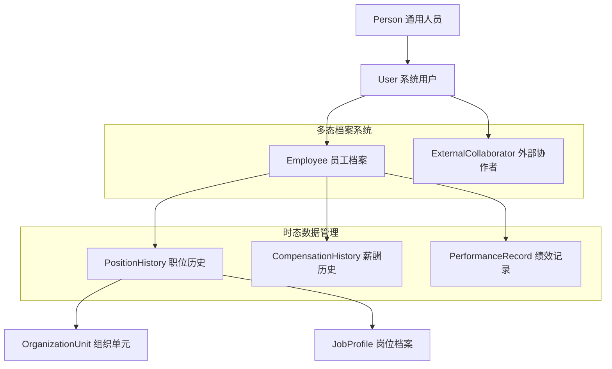

# Cube Castle员工模型系统功能实现开发规划

## 执行摘要

本规划基于对《员工模型设计开发规划》、《元合约v6.0》的深入研究，结合当前Cube Castle项目的技术架构现状，制定了一份切实可行的员工模型系统功能实现路线图。

**核心结论**：
- 当前项目架构已达企业级标准，具备实现复杂员工模型的技术基础
- 推荐从当前原生SQL架构向Ent框架迁移，实现"元合约即代码"的架构愿景
- 采用垂直切片策略，分三个阶段实施，最大化风险控制和价值交付

---

## 第一部分：战略对齐与技术决策

### 1.1 架构哲学对齐

基于《元合约v6.0》的"城堡模型"理念，员工模型实现必须严格遵循以下核心原则：

**🏰 城堡组件映射**：
- **主堡 (CoreHR Keep)**: 员工核心数据和业务逻辑
- **身份塔楼 (Identity Tower)**: 用户认证和权限管理
- **智能网关塔楼 (Intelligence Tower)**: AI驱动的员工管理交互

**⚖️ 四大支柱实现**：
1. **可信赖**: 事务性发件箱 + RLS租户隔离 + 审计事件
2. **智能化**: AI意图识别 + 图数据洞察 + 对话式体验
3. **可扩展**: 混合多租户 + 垂直扩展优先 + 专属筒仓
4. **可治理**: 嵌入式OPA + 元合约宪法 + 活合约治理

### 1.2 技术栈演进决策

**🔄 从当前架构到目标架构的迁移路径**：

| 组件 | 当前状态 | 目标状态 | 迁移策略 |
|------|----------|----------|----------|
| **ORM层** | 原生SQL + 基础模型 | Ent框架 + 自动生成 | 分阶段迁移，保持兼容 |
| **工作流引擎** | Temporal (已完善) | Temporal + 业务流程扩展 | 增量添加员工生命周期流程 |
| **数据同步** | 手动事务性发件箱 | 自动化混合持久化 | 实施声明式持久化配置 |
| **图数据建模** | 基础Neo4j集成 | 完整组织关系图谱 | 扩展图模式和查询能力 |
| **AI集成** | gRPC基础通信 | 深度业务集成 | 实施SAM情境感知模型 |

### 1.3 元合约编译器设计

**核心创新**：实现从《元合约v6.0》到Ent Schema的自动转译

```go
// 元合约编译器核心接口
type MetaContractCompiler interface {
    // 解析元合约YAML文件
    ParseMetaContract(yamlPath string) (*MetaContract, error)
    
    // 生成Ent Schema文件
    GenerateEntSchemas(contract *MetaContract, outputDir string) error
    
    // 生成业务逻辑骨架
    GenerateBusinessLogic(contract *MetaContract, outputDir string) error
    
    // 生成API路由定义
    GenerateAPIRoutes(contract *MetaContract, outputDir string) error
}
```

---

## 第二部分：员工模型架构设计

### 2.1 核心实体设计

基于《元合约v6.0》的多态性和时态模型要求，设计如下实体架构：

**🏗️ 实体层次结构**：



### 2.2 Ent Schema映射

**📋 基于《员工模型设计开发规划》的Ent实现**：

```go
// ent/schema/person.go - 通用人员基础
type Person struct {
    ent.Schema
}

func (Person) Fields() []ent.Field {
    return []ent.Field{
        field.UUID("id", uuid.UUID{}).Default(uuid.New).Immutable(),
        field.UUID("tenant_id", uuid.UUID{}).Immutable(),
        field.String("person_type").NotEmpty(), // 多态鉴别器
        field.String("first_name").NotEmpty(),
        field.String("last_name").NotEmpty(),
        field.String("email").Unique().NotEmpty(),
        field.Time("created_at").Default(time.Now).Immutable(),
        field.Time("updated_at").Default(time.Now).UpdateDefault(time.Now),
    }
}

func (Person) Annotations() []schema.Annotation {
    return []schema.Annotation{
        annotations.MetaContractAnnotation{
            DataClassification: "CONFIDENTIAL",
            ComplianceTags:     []string{"GDPR", "SOX"},
        },
    }
}
```

### 2.3 多态关系实现

**🔗 显式一对一边模式**（避免通用列反模式）：

```go
// 在Person实体中定义多态边
func (Person) Edges() []ent.Edge {
    return []ent.Edge{
        // 员工档案 - 可选的一对一关系
        edge.To("employee_profile", EmployeeProfile.Type).Unique(),
        
        // 外部协作者档案 - 可选的一对一关系
        edge.To("external_collaborator_profile", ExternalCollaboratorProfile.Type).Unique(),
    }
}

// EmployeeProfile实体
func (EmployeeProfile) Edges() []ent.Edge {
    return []ent.Edge{
        // 反向边，指向拥有者
        edge.From("person", Person.Type).
            Ref("employee_profile").
            Unique().
            Required(),
            
        // 职位历史 - 一对多关系
        edge.To("position_history", PositionHistory.Type),
        
        // 薪酬历史 - 一对多关系  
        edge.To("compensation_history", CompensationHistory.Type),
    }
}
```

### 2.4 时态数据模型

**⏰ 不可变历史记录模式**：

```go
// ent/schema/positionhistory.go
type PositionHistory struct {
    ent.Schema
}

func (PositionHistory) Fields() []ent.Field {
    return []ent.Field{
        field.UUID("id", uuid.UUID{}).Default(uuid.New).Immutable(),
        field.UUID("tenant_id", uuid.UUID{}).Immutable(),
        
        // 职位信息
        field.String("position_title").NotEmpty(),
        field.String("department").NotEmpty(),
        field.String("job_level").Optional(),
        
        // 时态字段
        field.Time("effective_date"),     // 生效日期
        field.Time("end_date").Optional(), // 失效日期(当前记录为null)
        
        // 审计字段
        field.UUID("created_by").Optional(),
        field.Time("created_at").Default(time.Now).Immutable(),
        field.String("change_reason").Optional(),
    }
}

func (PositionHistory) Indexes() []ent.Index {
    return []ent.Index{
        // 租户内的时间范围查询优化
        index.Fields("tenant_id", "employee_id", "effective_date"),
        
        // 当前职位查询优化（end_date为null）
        index.Fields("employee_id").Where(sql.IsNull("end_date")),
    }
}
```

---

## 第三部分：业务流程设计

### 3.1 员工生命周期工作流

**🔄 基于Temporal的事件驱动生命周期**：

```go
// workflow/employee_lifecycle.go
func EmployeeLifecycleWorkflow(ctx workflow.Context, req EmployeeLifecycleRequest) (*EmployeeLifecycleResult, error) {
    logger := workflow.GetLogger(ctx)
    
    // 阶段1：入职前准备
    var onboardingResult OnboardingResult
    err := workflow.ExecuteActivity(ctx, 
        activities.PrepareOnboardingActivity, 
        req.OnboardingData).Get(ctx, &onboardingResult)
    
    // 阶段2：等待入职确认信号
    var confirmationSignal ConfirmationSignal
    workflow.GetSignalChannel(ctx, "employee_onboarding_confirmed").
        Receive(ctx, &confirmationSignal)
    
    // 阶段3：创建员工记录（事件驱动）
    var employeeResult CreateEmployeeResult
    err = workflow.ExecuteActivity(ctx,
        activities.CreateEmployeeActivity,
        CreateEmployeeRequest{
            OnboardingID: req.OnboardingID,
            TenantID:     req.TenantID,
            PersonData:   req.PersonData,
        }).Get(ctx, &employeeResult)
    
    // 阶段4：初始化职位历史
    err = workflow.ExecuteActivity(ctx,
        activities.CreateInitialPositionActivity,
        CreatePositionRequest{
            EmployeeID:    employeeResult.EmployeeID,
            PositionData:  req.InitialPosition,
            EffectiveDate: req.StartDate,
        }).Get(ctx, nil)
    
    return &EmployeeLifecycleResult{
        EmployeeID: employeeResult.EmployeeID,
        Status:     "ACTIVE",
    }, nil
}
```

### 3.2 职位变更工作流

**📈 支持追溯和未来日期的职位变更**：

```go
func PositionChangeWorkflow(ctx workflow.Context, req PositionChangeRequest) (*PositionChangeResult, error) {
    // 1. 验证变更有效性
    var validationResult ValidationResult
    err := workflow.ExecuteActivity(ctx,
        activities.ValidatePositionChangeActivity,
        req).Get(ctx, &validationResult)
    
    if !validationResult.IsValid {
        return &PositionChangeResult{
            Success: false,
            Error:   validationResult.ErrorMessage,
        }, nil
    }
    
    // 2. 处理时间线一致性
    if req.EffectiveDate.Before(time.Now()) {
        // 追溯处理 - 触发重算流程
        err = workflow.ExecuteActivity(ctx,
            activities.ProcessRetroactiveChangeActivity,
            req).Get(ctx, nil)
            
        // 触发下游系统重算
        if req.TriggersRecalculation {
            workflow.ExecuteChildWorkflow(ctx,
                PayrollRecalculationWorkflow,
                PayrollRecalculationRequest{
                    EmployeeID:    req.EmployeeID,
                    EffectiveDate: req.EffectiveDate,
                })
        }
    }
    
    // 3. 创建职位历史记录
    var positionResult CreatePositionHistoryResult
    err = workflow.ExecuteActivity(ctx,
        activities.CreatePositionHistoryActivity,
        req).Get(ctx, &positionResult)
    
    return &PositionChangeResult{
        Success:           true,
        PositionHistoryID: positionResult.ID,
    }, nil
}
```

### 3.3 业务流程事件发布

**📤 事务性发件箱自动化**：

```go
// activities/employee_activities.go
func (a *Activities) CreateEmployeeActivity(ctx context.Context, req CreateEmployeeRequest) (*CreateEmployeeResult, error) {
    // 1. 开始数据库事务
    tx, err := a.db.BeginTx(ctx, nil)
    if err != nil {
        return nil, err
    }
    defer tx.Rollback()
    
    // 2. 创建Person记录
    person, err := a.entClient.Person.Create().
        SetTenantID(req.TenantID).
        SetPersonType("EMPLOYEE").
        SetFirstName(req.PersonData.FirstName).
        SetLastName(req.PersonData.LastName).
        SetEmail(req.PersonData.Email).
        SaveX(ctx)
    
    // 3. 创建EmployeeProfile记录
    employee, err := a.entClient.EmployeeProfile.Create().
        SetPerson(person).
        SetEmployeeNumber(generateEmployeeNumber()).
        SetHireDate(req.StartDate).
        SaveX(ctx)
    
    // 4. 在同一事务中创建业务事件
    event := &BusinessProcessEvent{
        EventID:     uuid.New(),
        EventType:   "HR.Employee.Created",
        TenantID:    req.TenantID,
        EntityID:    employee.ID,
        Payload:     marshalEmployeeData(employee),
        CreatedAt:   time.Now(),
    }
    
    err = a.outboxService.PublishEvent(ctx, tx, event)
    if err != nil {
        return nil, err
    }
    
    // 5. 提交事务
    if err = tx.Commit(); err != nil {
        return nil, err
    }
    
    // 记录业务指标
    a.metricsCollector.IncCounter("employee_created_total", 
        map[string]string{
            "tenant_id": req.TenantID.String(),
            "department": req.PersonData.Department,
        })
    
    return &CreateEmployeeResult{
        EmployeeID: employee.ID,
        PersonID:   person.ID,
    }, nil
}
```

---

## 第四部分：AI集成与智能化

### 4.1 情境感知模型(SAM)实现

**🧠 基于《元合约v6.0》模块13的SAM实现**：

```go
// intelligence/context_aware_model.go
type SituationalAwarenessModel struct {
    intentClassifier  IntentClassifier
    entityExtractor   EntityExtractor
    contextEnricher   ContextEnricher
    opaAuthorizer     *opa.OPA
}

func (sam *SituationalAwarenessModel) ProcessEmployeeQuery(
    ctx context.Context,
    query string,
    uiContext UIContext,
    userContext UserContext,
) (*IntentResponse, error) {
    
    // 1. 基于UI上下文的意图增强
    enrichedQuery := sam.contextEnricher.EnrichQuery(query, uiContext)
    
    // 2. 意图识别
    intent, confidence := sam.intentClassifier.ClassifyIntent(enrichedQuery)
    
    // 3. 实体抽取
    entities := sam.entityExtractor.ExtractEntities(enrichedQuery, intent)
    
    // 4. 安全授权检查
    authorized, err := sam.opaAuthorizer.IsAuthorized(ctx, AuthorizationInput{
        UserID:    userContext.UserID,
        TenantID:  userContext.TenantID,
        Intent:    intent.Name,
        Entities:  entities,
        Context:   uiContext.DataContext,
    })
    
    if !authorized {
        return &IntentResponse{
            Intent: intent,
            Status: "UNAUTHORIZED",
            Message: "您没有权限执行此操作",
        }, nil
    }
    
    // 5. 生成结构化响应
    return &IntentResponse{
        Intent:     intent,
        Entities:   entities,
        Confidence: confidence,
        Status:     "AUTHORIZED",
        NextAction: sam.determineNextAction(intent, entities),
    }, nil
}
```

### 4.2 员工管理智能助手

**🤖 对话式员工管理接口**：

```go
// 支持的员工管理意图
var EmployeeManagementIntents = []IntentDefinition{
    {
        IntentID:              "CreateEmployee",
        Description:           "创建新员工",
        TriggeredEventType:    "HR.Employee.CreationRequested",
        RequiredEntities:      []string{"firstName", "lastName", "email", "department", "position"},
        EntityValidationSchema: employeeCreationSchema,
        RequiredPermissions:   []string{"hr.employee.create"},
    },
    {
        IntentID:              "UpdateEmployeePosition", 
        Description:           "更新员工职位",
        TriggeredEventType:    "HR.Employee.PositionChangeRequested",
        RequiredEntities:      []string{"employeeId", "newPosition", "effectiveDate"},
        EntityValidationSchema: positionChangeSchema,
        RequiredPermissions:   []string{"hr.employee.position.update"},
    },
    {
        IntentID:              "QueryReportingStructure",
        Description:           "查询汇报关系",
        TriggeredEventType:    "", // 查询操作不触发事件
        RequiredEntities:      []string{"employeeId"},
        EntityValidationSchema: reportingQuerySchema,
        RequiredPermissions:   []string{"hr.organization.read"},
    },
}
```

### 4.3 图数据洞察系统

**🔍 基于Neo4j的组织洞察**：

```cypher
-- 复杂组织关系查询示例
// 查找某员工的完整汇报链
MATCH path = (emp:Employee {employee_id: $employeeId})-[:REPORTS_TO*0..]->(manager:Employee)
WHERE emp.tenant_id = $tenantId AND manager.tenant_id = $tenantId
RETURN 
  emp.employee_number as employee,
  manager.employee_number as manager,
  length(path) as reporting_level,
  manager.position_title as manager_position

// 查找跨部门协作关系
MATCH (emp1:Employee)-[:COLLABORATES_WITH]-(emp2:Employee)
WHERE emp1.tenant_id = $tenantId 
  AND emp2.tenant_id = $tenantId
  AND emp1.department <> emp2.department
RETURN 
  emp1.department as dept1,
  emp2.department as dept2,
  count(*) as collaboration_count
ORDER BY collaboration_count DESC
```

---

## 第五部分：实施路线图

### 5.1 垂直切片策略

**📋 基于《元合约v6.0》第三部分的三阶段实施**：

#### 阶段1：核心基础 (2-3周)
**🎯 目标**: 建立员工模型的技术基础和核心集成

**关键任务**:
1. **元合约编译器开发**:
   - 实现YAML解析器
   - 创建Ent Schema生成器
   - 建立代码生成流水线

2. **基础实体实施**:
   - Person/Employee实体迁移到Ent
   - 实现多态档案模式
   - 建立租户隔离策略

3. **核心工作流集成**:
   - 扩展现有Temporal工作流
   - 实现员工创建工作流
   - 建立事务性发件箱自动化

**验收标准**:
- ✅ 元合约编译器可成功生成Ent Schema
- ✅ 员工创建工作流端到端测试通过
- ✅ 多租户数据隔离测试通过
- ✅ 事务性事件发布测试通过

#### 阶段2：业务完善 (3-4周)  
**🎯 目标**: 实现完整的员工生命周期管理

**关键任务**:
1. **时态数据管理**:
   - 实现职位历史跟踪
   - 建立追溯处理机制
   - 实现时间线一致性验证

2. **高级工作流**:
   - 职位变更工作流
   - 离职处理工作流
   - 组织变更工作流

3. **图数据集成**:
   - 组织关系自动同步
   - 汇报链查询优化
   - 图数据洞察API

**验收标准**:
- ✅ 职位历史追溯功能测试通过
- ✅ 组织关系图同步测试通过  
- ✅ 复杂查询性能达标(<200ms)
- ✅ 工作流容错测试通过

#### 阶段3：智能化升级 (2-3周)
**🎯 目标**: 实现AI驱动的智能员工管理

**关键任务**:
1. **SAM情境感知实现**:
   - UI上下文集成
   - 意图识别优化
   - 实体抽取增强

2. **智能助手功能**:
   - 自然语言员工查询
   - 智能组织洞察
   - 对话式操作界面

3. **GraphQL API生成**:
   - 自动生成GraphQL Schema
   - 实现复杂关系查询
   - 建立查询性能监控

**验收标准**:
- ✅ AI意图识别准确率>85%
- ✅ 对话式查询响应时间<2秒
- ✅ GraphQL复杂查询测试通过
- ✅ 端到端智能助手演示成功

### 5.2 技术风险管控

**⚠️ 关键风险点与缓解策略**:

| 风险类别 | 具体风险 | 缓解策略 | 监控指标 |
|----------|----------|----------|----------|
| **架构迁移** | Ent框架迁移兼容性 | 分阶段迁移，保持API兼容 | 迁移覆盖率，API响应时间 |
| **数据一致性** | PostgreSQL与Neo4j同步 | 事务性发件箱+重试机制 | 同步延迟，失败率 |
| **性能影响** | 复杂查询性能下降 | 索引优化，查询计划分析 | 查询响应时间P95<200ms |
| **AI集成** | 意图识别准确率 | 训练数据扩充，模型调优 | 识别准确率>85% |

### 5.3 质量保障体系

**🔍 多层次质量检查**:

1. **单元测试**: 业务逻辑覆盖率>95%
2. **集成测试**: 工作流端到端测试
3. **性能测试**: 关键API压力测试  
4. **安全测试**: 租户隔离和授权测试
5. **用户测试**: AI交互准确性测试

---

## 第六部分：成功度量与监控

### 6.1 技术指标

**📊 关键技术KPI**:

```yaml
技术性能指标:
  - API响应时间P95: <200ms
  - 工作流执行成功率: >99.5%
  - 数据同步延迟: <30秒
  - 系统可用性: >99.9%

开发效率指标:
  - 代码生成覆盖率: >80%
  - 测试覆盖率: >95%
  - 部署频率: 每日多次
  - 缺陷逃逸率: <2%

AI效能指标:
  - 意图识别准确率: >85%
  - 实体抽取准确率: >90%  
  - 查询响应时间: <2秒
  - 用户满意度: >4.0/5.0
```

### 6.2 业务价值指标

**💼 业务影响评估**:

```yaml
用户体验指标:
  - 员工信息更新时间: 从分钟级到秒级
  - 组织查询复杂度: 支持7层嵌套查询
  - 智能助手使用率: >60%
  - 操作错误率降低: >50%

运营效率指标:
  - 员工入职自动化率: >90%
  - 数据质量问题: <1%
  - 合规审计准备时间: <1天
  - IT支持工单减少: >30%
```

---

## 结论与下一步行动

### 核心成果预期

通过本实施规划，Cube Castle项目将实现：

1. **架构现代化**: 从原生SQL升级到Ent框架，实现"元合约即代码"
2. **业务智能化**: AI驱动的员工管理，支持自然语言交互
3. **运营自动化**: 完整的员工生命周期工作流自动化
4. **治理规范化**: 基于元合约的统一治理和合规体系

### 立即行动项

**🚀 前3天执行清单**:
1. 设立项目团队和技术决策委员会
2. 创建元合约编译器开发分支
3. 建立第一个Ent实体的概念验证
4. 制定详细的阶段1工作计划

**📅 第一周里程碑**:
- 元合约编译器MVP完成
- Person实体Ent迁移完成
- 员工创建工作流基础版本

本规划基于对当前技术架构的深入分析和未来愿景的清晰规划，为Cube Castle项目的员工模型实现提供了一条切实可行、风险可控的实施路径。通过严格执行本规划，项目将在保持现有系统稳定性的同时，成功实现向现代化、智能化HR管理系统的转型。