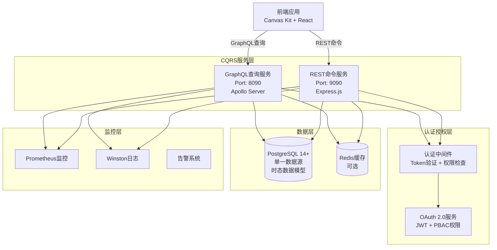

# 技术架构设计方案

**文档版本**: v1.0  
**创建日期**: 2025-08-23  
**适用阶段**: 项目开发早期 - 核心架构设计  
**技术原则**: API优先 + 现代化技术栈 + 无历史包袱  

## 🏗️ 整体架构设计

### 系统架构总览


### 核心设计原则
```yaml
架构原则:
  CQRS分离: 严格的读写分离，无协议混用
  单一数据源: PostgreSQL唯一数据源，无同步复杂性  
  API优先: 基于OpenAPI和GraphQL Schema的契约优先开发
  类型安全: TypeScript端到端类型安全
  
质量原则:
  性能优先: 查询<200ms, 命令<300ms目标
  安全第一: OAuth 2.0 + JWT + 细粒度权限控制
  可观测性: 完整的监控、日志、链路追踪
  测试驱动: >90%测试覆盖率，自动化质量保证
```

## 🔧 技术栈详细选型

### 后端技术栈
```yaml
核心技术:
  Runtime: Node.js 18.17+ LTS
    选择理由: LTS版本稳定，性能优异，生态丰富
    
  Language: TypeScript 5.1+
    配置: strict: true, 完整类型检查
    选择理由: 类型安全，减少运行时错误，提升开发效率
    
GraphQL服务技术栈:
  GraphQL Server: Apollo Server 4.9+
    选择理由: 成熟的GraphQL实现，丰富的中间件生态
    
  Schema Management: GraphQL Code Generator
    用途: 自动生成TypeScript类型和解析器模板
    
  性能优化: DataLoader + Apollo Cache
    用途: 解决N+1查询问题，提升查询性能

REST服务技术栈:
  Web Framework: Express.js 4.18+
    选择理由: 轻量级，中间件生态丰富，性能稳定
    
  API文档: Swagger/OpenAPI 3.0 + swagger-ui-express
    用途: 自动生成API文档，支持在线测试
    
  请求验证: express-validator + joi
    用途: 请求参数验证，数据类型校验

数据访问层:
  ORM: Prisma 5.2+
    选择理由: 现代化ORM，优秀的TypeScript支持，迁移管理完善
    
  连接池: Prisma内置连接池
    配置: 最大连接数50，超时30秒
    
  查询优化: 原生SQL + Prisma Raw Query
    用途: 复杂时态查询和性能关键查询
```

### 认证授权技术栈
```yaml
认证技术:
  Protocol: OAuth 2.0 Client Credentials Flow
    选择理由: 标准化，适合机器对机器通信
    
  Token: JWT (JSON Web Token)
    签名算法: RS256 (RSA + SHA256)
    过期时间: 1小时 (可配置)
    
  中间件: express-jwt + jsonwebtoken
    功能: Token验证、权限检查、审计记录

权限控制:
  模型: PBAC (Permission-Based Access Control)
    权限数量: 17个细粒度权限
    权限分组: 4种角色预设 (只读、编辑、管理、运维)
    
  实现: 自定义权限检查中间件
    功能: 动态权限验证、租户隔离、审计日志
```

### 监控和日志技术栈
```yaml
监控系统:
  指标收集: prom-client (Prometheus Node.js客户端)
    监控指标: API响应时间、错误率、数据库连接数
    
  可视化: Grafana Dashboard
    仪表板: API性能、业务指标、系统资源
    
  告警: Prometheus Alertmanager
    告警渠道: Slack + Email + PagerDuty集成

日志系统:
  日志库: Winston 3.10+
    格式: 结构化JSON日志
    级别: error, warn, info, debug
    
  日志聚合: ELK Stack (可选) 或 简单文件日志
    存储: 按日分割，保留30天
    
  链路追踪: 请求ID追踪，跨服务调用链
```

## 🗄️ 数据库设计详细

### PostgreSQL版本和配置
```yaml
数据库版本: PostgreSQL 14.9+
选择理由: 
  - 优秀的JSON支持 (profile字段)
  - 强大的递归CTE (层级查询)
  - 丰富的索引类型 (GIN、GiST)
  - 时态数据原生支持

连接配置:
  最大连接数: 200
  连接池大小: 50 (Prisma管理)
  连接超时: 30秒
  查询超时: 60秒
  
性能调优参数:
  shared_buffers: 256MB
  work_mem: 4MB  
  maintenance_work_mem: 64MB
  effective_cache_size: 1GB
```

### 核心表结构设计
```sql
-- 组织单元主表
CREATE TABLE organization_units (
  -- 主键设计 (支持时态数据)
  code VARCHAR(7) NOT NULL,                    -- 业务编码 (1000000-9999999)
  effective_date DATE NOT NULL,                -- 生效日期
  
  -- 基础信息
  tenant_id UUID NOT NULL,                     -- 租户ID
  name VARCHAR(255) NOT NULL,                  -- 组织名称
  unit_type VARCHAR(20) NOT NULL,              -- 单元类型枚举
  status VARCHAR(20) NOT NULL DEFAULT 'ACTIVE', -- 业务状态
  is_deleted BOOLEAN NOT NULL DEFAULT false,   -- 删除标记
  
  -- 层级信息  
  parent_code VARCHAR(7),                      -- 父组织编码
  level INTEGER NOT NULL DEFAULT 1,            -- 层级级别 (1-17)
  hierarchy_depth INTEGER NOT NULL DEFAULT 1,  -- 层级深度缓存
  code_path TEXT NOT NULL,                     -- 编码路径 (/1000000/1000001)
  name_path TEXT NOT NULL,                     -- 名称路径 (/公司/部门)
  
  -- 配置信息
  sort_order INTEGER NOT NULL DEFAULT 0,       -- 排序
  description TEXT,                            -- 描述
  profile JSONB NOT NULL DEFAULT '{}',         -- 动态配置
  
  -- 审计信息
  record_id UUID NOT NULL DEFAULT gen_random_uuid(), -- 记录唯一ID
  created_at TIMESTAMPTZ NOT NULL DEFAULT NOW(),     -- 记录创建时间
  updated_at TIMESTAMPTZ NOT NULL DEFAULT NOW(),     -- 最后操作时间
  operation_type VARCHAR(20) NOT NULL,               -- 操作类型
  operated_by JSONB NOT NULL,                        -- 操作人信息 {id, name}
  operation_reason TEXT,                              -- 操作原因
  
  -- 时态信息
  end_date DATE,                               -- 结束日期 (NULL=无限期)
  
  -- 主键和约束
  PRIMARY KEY (code, effective_date),
  UNIQUE (record_id),
  
  -- 检查约束
  CONSTRAINT valid_unit_type CHECK (unit_type IN ('DEPARTMENT', 'COST_CENTER', 'COMPANY', 'PROJECT_TEAM')),
  CONSTRAINT valid_status CHECK (status IN ('ACTIVE', 'INACTIVE')),
  CONSTRAINT valid_operation_type CHECK (operation_type IN ('CREATE', 'UPDATE', 'SUSPEND', 'REACTIVATE', 'DELETE')),
  CONSTRAINT valid_level CHECK (level >= 1 AND level <= 17),
  CONSTRAINT valid_date_range CHECK (effective_date <= COALESCE(end_date, '9999-12-31'::date)),
  
  -- 外键约束
  FOREIGN KEY (parent_code, effective_date) REFERENCES organization_units(code, effective_date) DEFERRABLE
);

-- 审计历史表 (详细审计记录)
CREATE TABLE organization_audit_log (
  audit_id UUID PRIMARY KEY DEFAULT gen_random_uuid(),
  business_entity_id VARCHAR(7) NOT NULL,      -- 业务实体ID (组织编码)
  record_id UUID NOT NULL,                     -- 关联的记录ID
  version_sequence INTEGER NOT NULL,           -- 版本序号
  operation VARCHAR(20) NOT NULL,              -- 操作类型
  timestamp TIMESTAMPTZ NOT NULL DEFAULT NOW(), -- 操作时间
  user_info JSONB NOT NULL,                    -- 用户信息
  operation_context JSONB,                     -- 操作上下文
  before_data JSONB,                           -- 操作前数据
  after_data JSONB,                            -- 操作后数据
  field_changes JSONB,                         -- 字段级变更
  risk_level VARCHAR(10) DEFAULT 'LOW'         -- 风险等级
);
```

### 索引设计策略
```sql
-- 1. 主键和唯一索引
CREATE UNIQUE INDEX organization_units_pkey ON organization_units (code, effective_date);
CREATE UNIQUE INDEX idx_org_units_record_id ON organization_units (record_id);

-- 2. 核心业务查询索引
CREATE INDEX idx_org_current_effective ON organization_units 
  (tenant_id, code, effective_date DESC, end_date DESC NULLS LAST)
  WHERE is_deleted = false;

CREATE INDEX idx_org_units_tenant_status ON organization_units 
  (tenant_id, status, is_deleted, effective_date DESC);

CREATE INDEX idx_org_units_parent_code ON organization_units 
  (parent_code, effective_date DESC) 
  WHERE parent_code IS NOT NULL AND is_deleted = false;

-- 3. 时态查询优化索引
CREATE INDEX idx_org_temporal_range ON organization_units 
  (tenant_id, effective_date, end_date) 
  WHERE is_deleted = false;

CREATE INDEX idx_org_future_records ON organization_units 
  (tenant_id, effective_date) 
  WHERE effective_date > CURRENT_DATE AND is_deleted = false;

-- 4. 层级管理索引
CREATE INDEX idx_org_hierarchy_path ON organization_units 
  USING gin(code_path gin_trgm_ops);

CREATE INDEX idx_org_level_depth ON organization_units 
  (tenant_id, level, hierarchy_depth, is_deleted);

-- 5. 审计查询索引
CREATE INDEX idx_org_operation_audit ON organization_units 
  (tenant_id, operation_type, updated_at DESC);

CREATE INDEX idx_org_operated_by ON organization_units 
  USING gin(operated_by);

-- 6. 全文搜索索引
CREATE INDEX idx_org_name_search ON organization_units 
  USING gin(to_tsvector('english', name));

CREATE INDEX idx_org_profile_search ON organization_units 
  USING gin(profile);

-- 7. 审计表索引
CREATE INDEX idx_audit_business_entity ON organization_audit_log 
  (business_entity_id, timestamp DESC);

CREATE INDEX idx_audit_record_version ON organization_audit_log 
  (record_id, version_sequence);

CREATE INDEX idx_audit_operation_time ON organization_audit_log 
  (operation, timestamp DESC);

-- 8. 性能监控索引
CREATE INDEX idx_org_stats_type ON organization_units 
  (tenant_id, unit_type, status, is_deleted, effective_date DESC);

CREATE INDEX idx_org_stats_level ON organization_units 
  (tenant_id, level, is_deleted, effective_date DESC);
```

## 📡 API服务详细设计

### GraphQL服务架构
```typescript
// GraphQL Schema设计
type Query {
  # 组织查询
  organizations(filter: OrganizationFilter, pagination: PaginationInput): OrganizationConnection!
  organization(code: String!, asOfDate: Date): Organization
  organizationStats(asOfDate: Date): OrganizationStats!
  
  # 层级管理查询
  organizationHierarchy(code: String!, tenantId: UUID!): OrganizationHierarchy!
  organizationSubtree(code: String!, tenantId: UUID!, maxDepth: Int): [OrganizationNode!]!
  hierarchyStatistics(tenantId: UUID!): HierarchyStats!
  
  # 审计查询
  organizationAuditHistory(code: String!, filter: AuditFilter): AuditHistory!
  auditLog(auditId: String!): DetailedAuditRecord!
  
  # 系统查询
  hierarchyConsistencyCheck(tenantId: UUID!, checkMode: ConsistencyCheckMode): ConsistencyReport!
}

# 核心类型定义
type Organization {
  code: String!
  parentCode: String
  tenantId: UUID!
  name: String!
  unitType: UnitType!
  status: Status!
  isDeleted: Boolean!
  
  # 层级信息
  level: Int!
  hierarchyDepth: Int!
  codePath: String!
  namePath: String!
  
  # 时态信息
  effectiveDate: Date!
  endDate: Date
  isCurrent: Boolean!    # 动态计算
  isFuture: Boolean!     # 动态计算
  
  # 审计信息
  createdAt: DateTime!
  updatedAt: DateTime!
  operationType: OperationType!
  operatedBy: OperatedBy!
  operationReason: String
  
  # 配置信息
  sortOrder: Int!
  description: String
  profile: JSON!
  recordId: UUID!
}

# GraphQL解析器实现
const resolvers = {
  Query: {
    organizations: async (parent, args, context) => {
      // 权限检查
      requirePermission(context, 'org:read');
      
      // 时态查询逻辑
      const asOfDate = args.filter?.asOfDate || new Date();
      
      // 使用优化的SQL查询
      const query = `
        WITH temporal_orgs AS (
          SELECT *,
            (effective_date <= $1 
             AND (end_date IS NULL OR end_date >= $1) 
             AND is_deleted = false) as is_current,
            (effective_date > $1 
             AND is_deleted = false) as is_future
          FROM organization_units
          WHERE tenant_id = $2
        )
        SELECT * FROM temporal_orgs
        WHERE (is_current = true OR $3 = true)
        ORDER BY level, sort_order, name
        LIMIT $4 OFFSET $5
      `;
      
      return executeQuery(query, [asOfDate, context.tenantId, args.filter?.includeFuture, args.pagination?.limit, args.pagination?.offset]);
    },
    
    organizationHierarchy: async (parent, args, context) => {
      requirePermission(context, 'org:read:hierarchy');
      
      // 递归CTE查询层级路径
      const query = `
        WITH RECURSIVE org_hierarchy AS (
          -- 基础情况：目标组织
          SELECT code, parent_code, name, level, code_path, name_path, 1 as depth
          FROM organization_units 
          WHERE code = $1 AND tenant_id = $2 AND is_current = true
          
          UNION ALL
          
          -- 递归情况：向上查找父组织
          SELECT ou.code, ou.parent_code, ou.name, ou.level, ou.code_path, ou.name_path, oh.depth + 1
          FROM organization_units ou
          INNER JOIN org_hierarchy oh ON ou.code = oh.parent_code
          WHERE ou.tenant_id = $2 AND ou.is_current = true AND oh.depth < 17
        )
        SELECT * FROM org_hierarchy ORDER BY depth;
      `;
      
      return executeQuery(query, [args.code, args.tenantId]);
    }
  },
  
  Organization: {
    // 动态字段解析器
    isCurrent: (parent, args, context) => {
      const asOfDate = context.asOfDate || new Date();
      return parent.effective_date <= asOfDate && 
             (parent.end_date == null || parent.end_date >= asOfDate) &&
             !parent.is_deleted;
    },
    
    isFuture: (parent, args, context) => {
      const asOfDate = context.asOfDate || new Date();
      return parent.effective_date > asOfDate && !parent.is_deleted;
    }
  }
};
```

### REST服务架构
```typescript
// Express路由设计
import express from 'express';
import { authenticate, requirePermission } from '../middleware/auth';
import { validateRequest } from '../middleware/validation';
import { organizationService } from '../services/organization.service';

const router = express.Router();

// 标准CRUD操作
router.post('/organization-units', 
  authenticate,
  requirePermission('org:create'),
  validateRequest(createOrganizationSchema),
  async (req, res) => {
    try {
      const result = await organizationService.create(req.body, req.user);
      
      res.status(201).json({
        success: true,
        data: result,
        message: 'Organization unit created successfully',
        timestamp: new Date().toISOString(),
        requestId: req.requestId
      });
    } catch (error) {
      handleError(error, res);
    }
  }
);

router.put('/organization-units/:code',
  authenticate, 
  requirePermission('org:update'),
  validateRequest(updateOrganizationSchema),
  async (req, res) => {
    try {
      // PUT语义：完全替换
      const result = await organizationService.replace(req.params.code, req.body, req.user);
      
      res.json({
        success: true,
        data: result,
        message: 'Organization unit replaced successfully', 
        timestamp: new Date().toISOString(),
        requestId: req.requestId
      });
    } catch (error) {
      handleError(error, res);
    }
  }
);

router.patch('/organization-units/:code',
  authenticate,
  requirePermission('org:update'), 
  validateRequest(patchOrganizationSchema),
  async (req, res) => {
    try {
      // PATCH语义：部分更新
      const result = await organizationService.update(req.params.code, req.body, req.user);
      
      res.json({
        success: true,
        data: result,
        message: 'Organization unit updated successfully',
        timestamp: new Date().toISOString(),
        requestId: req.requestId
      });
    } catch (error) {
      handleError(error, res);
    }
  }
);

// 专用业务操作
router.post('/organization-units/:code/suspend',
  authenticate,
  requirePermission('org:suspend'),
  validateRequest(suspendOrganizationSchema),
  async (req, res) => {
    try {
      const result = await organizationService.suspend(
        req.params.code, 
        req.body.effectiveDate,
        req.body.operationReason,
        req.user
      );
      
      res.json({
        success: true,
        data: result,
        message: 'Organization unit suspended successfully',
        timestamp: new Date().toISOString(),
        requestId: req.requestId
      });
    } catch (error) {
      handleError(error, res);
    }
  }
);

router.post('/organization-units/:code/activate',
  authenticate,
  requirePermission('org:reactivate'),
  validateRequest(activateOrganizationSchema),
  async (req, res) => {
    try {
      const result = await organizationService.activate(
        req.params.code,
        req.body.effectiveDate, 
        req.body.operationReason,
        req.user
      );
      
      res.json({
        success: true,
        data: result,
        message: 'Organization unit activated successfully',
        timestamp: new Date().toISOString(),
        requestId: req.requestId
      });
    } catch (error) {
      handleError(error, res);
    }
  }
);

// 统一错误处理
const handleError = (error: any, res: express.Response) => {
  const timestamp = new Date().toISOString();
  const requestId = res.locals.requestId;
  
  // 记录错误日志
  logger.error('API Error', {
    error: error.message,
    stack: error.stack,
    requestId,
    timestamp
  });
  
  // 标准错误响应
  if (error.code === 'ORG_UNIT_NOT_FOUND') {
    return res.status(404).json({
      success: false,
      error: {
        code: error.code,
        message: error.message,
        details: error.details
      },
      timestamp,
      requestId
    });
  }
  
  // 默认500错误
  res.status(500).json({
    success: false,
    error: {
      code: 'INTERNAL_ERROR',
      message: 'Internal server error',
      details: null
    },
    timestamp,
    requestId
  });
};
```

## 🔐 认证授权详细实现

### OAuth 2.0服务实现
```typescript
// OAuth 2.0 Token端点
import jwt from 'jsonwebtoken';
import { readFileSync } from 'fs';

// RSA密钥对 (生产环境使用环境变量)
const PRIVATE_KEY = readFileSync('./keys/private.pem');
const PUBLIC_KEY = readFileSync('./keys/public.pem');

interface ClientCredentials {
  clientId: string;
  clientSecret: string;
  permissions: string[];
  tenantId: string;
}

// 客户端凭证验证 (实际应该从数据库查询)
const CLIENT_REGISTRY: Map<string, ClientCredentials> = new Map([
  ['a1b2c3d4-e5f6-g7h8-i9j0-k1l2m3n4o5p6', {
    clientId: 'a1b2c3d4-e5f6-g7h8-i9j0-k1l2m3n4o5p6',
    clientSecret: 'hashed-secret-value',
    permissions: ['org:read', 'org:create', 'org:update'],
    tenantId: '987fcdeb-51a2-43d7-8f9e-123456789012'
  }]
]);

// Token生成端点
app.post('/oauth/token', async (req, res) => {
  try {
    const { grant_type, client_id, client_secret } = req.body;
    
    // 验证grant_type
    if (grant_type !== 'client_credentials') {
      return res.status(400).json({
        error: 'unsupported_grant_type',
        error_description: 'Only client_credentials grant type is supported'
      });
    }
    
    // 验证客户端凭证
    const client = CLIENT_REGISTRY.get(client_id);
    if (!client || !await bcrypt.compare(client_secret, client.clientSecret)) {
      return res.status(401).json({
        error: 'invalid_client',
        error_description: 'Invalid client credentials'
      });
    }
    
    // 生成JWT
    const now = Math.floor(Date.now() / 1000);
    const payload = {
      iss: 'https://api.yourcompany.com',
      sub: client_id,
      aud: 'organization-management-api',
      exp: now + 3600, // 1小时过期
      iat: now,
      permissions: client.permissions,
      tenantId: client.tenantId,
      clientName: `Client-${client_id.substring(0, 8)}`
    };
    
    const accessToken = jwt.sign(payload, PRIVATE_KEY, { 
      algorithm: 'RS256',
      keyid: 'key-1' 
    });
    
    res.json({
      accessToken,
      tokenType: 'Bearer',
      expiresIn: 3600,
      scope: client.permissions.join(' ')
    });
    
  } catch (error) {
    res.status(500).json({
      error: 'server_error',
      error_description: 'Internal server error'
    });
  }
});
```

### 认证中间件实现
```typescript
// 认证中间件
import jwt from 'jsonwebtoken';
import { Request, Response, NextFunction } from 'express';

interface AuthRequest extends Request {
  user?: {
    clientId: string;
    permissions: string[];
    tenantId: string;
    clientName: string;
  };
  requestId?: string;
}

// JWT验证中间件
export const authenticate = (req: AuthRequest, res: Response, next: NextFunction) => {
  try {
    // 生成请求ID
    req.requestId = `req_${Date.now()}_${Math.random().toString(36).substr(2, 9)}`;
    
    // 提取Token
    const authHeader = req.headers.authorization;
    if (!authHeader || !authHeader.startsWith('Bearer ')) {
      return res.status(401).json({
        success: false,
        error: {
          code: 'MISSING_AUTHORIZATION',
          message: 'Authorization header is missing or invalid',
          details: null
        },
        timestamp: new Date().toISOString(),
        requestId: req.requestId
      });
    }
    
    const token = authHeader.substring(7);
    
    // 验证JWT
    const decoded = jwt.verify(token, PUBLIC_KEY, {
      algorithms: ['RS256'],
      issuer: 'https://api.yourcompany.com',
      audience: 'organization-management-api'
    }) as any;
    
    // 检查过期时间
    if (decoded.exp < Date.now() / 1000) {
      return res.status(401).json({
        success: false,
        error: {
          code: 'TOKEN_EXPIRED',
          message: 'Access token has expired',
          details: {
            expiredAt: new Date(decoded.exp * 1000).toISOString()
          }
        },
        timestamp: new Date().toISOString(),
        requestId: req.requestId
      });
    }
    
    // 设置用户上下文
    req.user = {
      clientId: decoded.sub,
      permissions: decoded.permissions || [],
      tenantId: decoded.tenantId,
      clientName: decoded.clientName
    };
    
    // 审计日志
    logger.info('Authentication successful', {
      clientId: req.user.clientId,
      tenantId: req.user.tenantId,
      endpoint: req.originalUrl,
      method: req.method,
      requestId: req.requestId
    });
    
    next();
    
  } catch (error) {
    return res.status(401).json({
      success: false,
      error: {
        code: 'INVALID_TOKEN',
        message: 'Invalid or malformed access token',
        details: null
      },
      timestamp: new Date().toISOString(),
      requestId: req.requestId
    });
  }
};

// 权限检查中间件工厂
export const requirePermission = (permission: string) => {
  return (req: AuthRequest, res: Response, next: NextFunction) => {
    if (!req.user || !req.user.permissions.includes(permission)) {
      // 审计日志
      logger.warn('Permission denied', {
        clientId: req.user?.clientId,
        requiredPermission: permission,
        currentPermissions: req.user?.permissions,
        endpoint: req.originalUrl,
        method: req.method,
        requestId: req.requestId
      });
      
      return res.status(403).json({
        success: false,
        error: {
          code: 'INSUFFICIENT_PERMISSIONS',
          message: 'Insufficient permissions to access this resource',
          details: {
            requiredPermissions: [permission],
            currentPermissions: req.user?.permissions || [],
            resource: req.originalUrl,
            action: req.method
          }
        },
        timestamp: new Date().toISOString(),
        requestId: req.requestId
      });
    }
    
    next();
  };
};

// 租户权限检查中间件  
export const requireTenantAccess = (req: AuthRequest, res: Response, next: NextFunction) => {
  const requestedTenant = req.params.tenantId || req.body.tenantId || req.query.tenantId;
  
  if (requestedTenant && requestedTenant !== req.user?.tenantId) {
    return res.status(403).json({
      success: false,
      error: {
        code: 'TENANT_ACCESS_DENIED', 
        message: 'Access denied to specified tenant resources',
        details: {
          requestedTenant,
          authorizedTenants: [req.user?.tenantId]
        }
      },
      timestamp: new Date().toISOString(),
      requestId: req.requestId
    });
  }
  
  next();
};
```

## 📊 监控和可观测性

### Prometheus监控指标
```typescript
// 监控指标收集
import promClient from 'prom-client';

// 创建指标收集器
const httpRequestDuration = new promClient.Histogram({
  name: 'http_request_duration_seconds',
  help: 'HTTP request duration in seconds',
  labelNames: ['method', 'route', 'status_code'],
  buckets: [0.1, 0.3, 0.5, 0.7, 1, 3, 5, 7, 10]
});

const httpRequestTotal = new promClient.Counter({
  name: 'http_requests_total',
  help: 'Total number of HTTP requests',
  labelNames: ['method', 'route', 'status_code']
});

const dbQueryDuration = new promClient.Histogram({
  name: 'database_query_duration_seconds',
  help: 'Database query duration in seconds',
  labelNames: ['query_type', 'table_name'],
  buckets: [0.01, 0.05, 0.1, 0.3, 0.5, 1, 3, 5]
});

const hierarchyOperationDuration = new promClient.Histogram({
  name: 'hierarchy_operation_duration_seconds',
  help: 'Hierarchy management operation duration',
  labelNames: ['operation_type', 'affected_units_count'],
  buckets: [0.5, 1, 2, 5, 10, 15, 30]
});

// 监控中间件
export const metricsMiddleware = (req: Request, res: Response, next: NextFunction) => {
  const startTime = Date.now();
  
  res.on('finish', () => {
    const duration = (Date.now() - startTime) / 1000;
    const route = req.route?.path || req.path;
    
    httpRequestDuration
      .labels(req.method, route, res.statusCode.toString())
      .observe(duration);
      
    httpRequestTotal
      .labels(req.method, route, res.statusCode.toString())
      .inc();
  });
  
  next();
};

// 业务指标监控
export class OrganizationMetrics {
  static recordHierarchyUpdate(operationType: string, affectedCount: number, duration: number) {
    hierarchyOperationDuration
      .labels(operationType, affectedCount.toString())
      .observe(duration);
  }
  
  static recordDatabaseQuery(queryType: string, tableName: string, duration: number) {
    dbQueryDuration
      .labels(queryType, tableName)
      .observe(duration);
  }
}

// 指标暴露端点
app.get('/metrics', async (req, res) => {
  res.set('Content-Type', promClient.register.contentType);
  res.end(await promClient.register.metrics());
});
```

### Winston日志配置
```typescript
// 日志配置
import winston from 'winston';

const logger = winston.createLogger({
  level: process.env.LOG_LEVEL || 'info',
  format: winston.format.combine(
    winston.format.timestamp(),
    winston.format.errors({ stack: true }),
    winston.format.json()
  ),
  defaultMeta: { 
    service: 'organization-management-api',
    version: process.env.APP_VERSION || '1.0.0'
  },
  transports: [
    // 错误日志文件
    new winston.transports.File({ 
      filename: 'logs/error.log',
      level: 'error',
      maxsize: 100 * 1024 * 1024, // 100MB
      maxFiles: 10,
      tailable: true
    }),
    
    // 所有日志文件
    new winston.transports.File({ 
      filename: 'logs/combined.log',
      maxsize: 100 * 1024 * 1024,
      maxFiles: 30,
      tailable: true
    }),
    
    // 控制台输出 (开发环境)
    new winston.transports.Console({
      level: process.env.NODE_ENV === 'production' ? 'warn' : 'debug',
      format: winston.format.combine(
        winston.format.colorize(),
        winston.format.simple()
      )
    })
  ]
});

// 业务日志记录器
export class AuditLogger {
  static logOperation(operation: string, details: any, userId?: string) {
    logger.info('Business Operation', {
      operation,
      userId,
      details,
      timestamp: new Date().toISOString(),
      category: 'BUSINESS_AUDIT'
    });
  }
  
  static logSecurityEvent(event: string, details: any, severity: 'low' | 'medium' | 'high' = 'medium') {
    logger.warn('Security Event', {
      event,
      severity,
      details,
      timestamp: new Date().toISOString(),
      category: 'SECURITY_AUDIT'
    });
  }
  
  static logPerformanceIssue(operation: string, duration: number, threshold: number) {
    logger.warn('Performance Issue', {
      operation,
      duration,
      threshold,
      timestamp: new Date().toISOString(),
      category: 'PERFORMANCE'
    });
  }
}
```

---

**文档制定**: 技术架构师  
**技术审查**: 资深开发工程师  
**适用项目**: Cube Castle组织架构管理系统  
**更新日期**: 2025-08-23  
**下次评审**: 第一阶段完成后