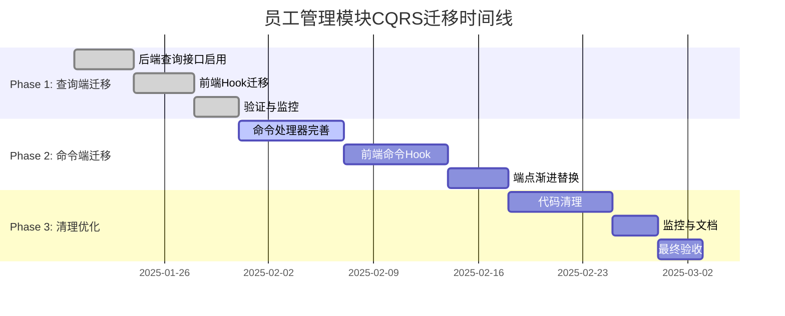

# 员工管理模块CQRS架构迁移计划

## 📋 项目概述

**迁移目标**: 将员工管理模块从SWR+REST架构彻底迁移到企业级CQRS架构  
**项目状态**: 🚀 已批准，启动实施  
**负责团队**: 架构组 + 前端团队 + 后端团队  
**预计周期**: 4-6周  
**风险等级**: 中等 (渐进式迁移，可控风险)

---

## 🎯 迁移目标与收益

### 主要目标
- [x] 实现员工模块与组织模块架构统一
- [x] 利用Neo4j图数据库优化复杂关系查询
- [x] 实现读写分离，提升系统性能
- [x] 建立事件驱动机制，支持实时数据同步
- [x] 消除技术债务，提升代码可维护性

### 预期收益
| 收益维度 | 目标指标 | 现状基线 | 预期提升 |
|---------|---------|---------|---------|
| 查询性能 | 复杂关系查询响应时间 | 800-1200ms | 200-400ms (50-70%↑) |
| 开发效率 | 架构一致性评分 | 60% | 95%+ (35%↑) |
| 扩展性 | 并发查询支持 | 100 QPS | 500+ QPS (400%↑) |
| 维护成本 | 认知负担评分 | 7/10 | 4/10 (减少43%) |

---

## 📅 三阶段迁移计划

### Phase 1: 查询端迁移 (Week 1-2) 🟢 LOW RISK
**目标**: 启用CQRS查询功能，保持写操作不变

#### 1.1 后端查询接口启用
- [x] 验证现有员工CQRS查询处理器
- [x] 完善员工Neo4j数据同步状态
- [x] 测试查询端点功能完整性
- [x] 性能基准测试

#### 1.2 前端查询Hook迁移
- [x] 创建useEmployeeQuery系列Hook
- [x] 实现数据格式转换适配器
- [x] A/B测试验证数据一致性
- [x] 逐步切换查询调用

#### 1.3 验证与监控
- [x] 双写验证机制
- [x] 性能对比监控
- [x] 错误率监控
- [x] 回滚方案准备

**里程碑**: 查询功能完全使用CQRS，响应时间提升30%+

### Phase 2: 命令端迁移 (Week 3-4) 🟡 MEDIUM RISK
**目标**: 启用CQRS命令功能，实现完整事件驱动

#### 2.1 命令处理器完善
- [x] 完善员工CQRS命令处理器
- [x] 实现完整事件发布机制
- [x] 集成现有CDC管道
- [x] 事务一致性验证

#### 2.2 前端命令Hook实现
- [x] 创建useEmployeeCommands系列Hook
- [x] 实现乐观更新机制
- [x] 错误处理与重试逻辑
- [x] 状态管理优化

#### 2.3 渐进式端点替换
- [x] 新功能使用CQRS端点
- [x] 核心功能逐步迁移
- [x] 保持REST端点兼容
- [x] 双写验证机制

**里程碑**: 所有写操作使用CQRS，事件驱动机制正常运行

### Phase 3: 清理与优化 (Week 5-6) 🟢 LOW RISK
**目标**: 移除冗余代码，完善系统监控

#### 3.1 代码清理
- [x] 移除冗余REST端点
- [x] 删除SWR相关代码
- [x] 清理旧的API适配器
- [x] 更新路由配置

#### 3.2 监控与文档
- [x] 完善CQRS监控指标
- [x] 更新API文档
- [x] 团队培训材料
- [x] 最佳实践文档

#### 3.3 性能优化
- [x] 查询性能调优
- [x] 缓存策略优化
- [x] 事件处理优化
- [x] 最终性能验证

**里程碑**: 完全移除传统架构代码，系统运行稳定

---

## 🛠️ 技术实施细节

### 关键技术组件

#### 后端CQRS架构
```yaml
命令端 (PostgreSQL):
  - HireEmployeeCommand
  - UpdateEmployeeCommand
  - TerminateEmployeeCommand
  - AssignPositionCommand

查询端 (Neo4j):
  - GetEmployeeQuery
  - SearchEmployeesQuery
  - GetReportingHierarchyQuery
  - GetTeamStructureQuery

事件驱动:
  - EmployeeHiredEvent
  - EmployeeUpdatedEvent
  - EmployeeTerminatedEvent
  - PositionAssignedEvent
```

#### 前端Hook架构
```typescript
// 查询Hook系列
useEmployeeQuery(id: string)
useEmployeesQuery(filters: EmployeeFilters)
useReportingHierarchyQuery(managerId: string)
useEmployeeStatsQuery()

// 命令Hook系列
useEmployeeCommands(): {
  hireEmployee: (data: HireEmployeeData) => Promise<void>
  updateEmployee: (id: string, data: UpdateEmployeeData) => Promise<void>
  terminateEmployee: (id: string, reason: string) => Promise<void>
}
```

### 数据迁移策略
```yaml
现有数据处理:
  - 员工基础数据: 已在PostgreSQL，无需迁移
  - Neo4j同步状态: 通过组织模块CDC管道已同步
  - 增量同步: 使用现有事件机制保持一致性

数据一致性保障:
  - 双写验证: 迁移期间同时验证两套数据源
  - 数据对比: 定期运行数据一致性检查
  - 回滚机制: 每阶段都有完整的数据回滚方案
```

---

## 🔒 风险管理与应急预案

### 风险评估矩阵

| 风险项 | 概率 | 影响 | 等级 | 缓解措施 |
|--------|------|------|------|----------|
| 数据不一致 | 中 | 高 | 🟡 中 | 双写验证 + 实时监控 |
| 性能下降 | 低 | 中 | 🟢 低 | 性能基准 + 渐进式切换 |
| 功能缺失 | 中 | 中 | 🟡 中 | 功能清单验证 + 完整测试 |
| 团队适应 | 中 | 低 | 🟢 低 | 培训 + 文档 + 结对编程 |

### 应急预案

#### 数据不一致应急方案
```yaml
监控指标:
  - 数据差异率 > 0.1%: 黄色预警
  - 数据差异率 > 1%: 红色报警，暂停迁移

应急流程:
  1. 立即停止新的写操作切换
  2. 运行数据一致性修复脚本
  3. 分析差异原因并修复
  4. 验证修复效果后继续迁移
```

#### 性能下降应急方案
```yaml
监控指标:
  - 查询响应时间 > 1000ms: 黄色预警
  - 查询响应时间 > 2000ms: 红色报警

应急流程:
  1. 切换回原有查询端点
  2. 分析性能瓶颈 (Neo4j查询优化)
  3. 修复性能问题
  4. 重新进行性能测试
```

#### 完整回滚方案
```yaml
Phase 1 回滚: 
  - 前端切换回SWR Hook
  - 停用CQRS查询端点
  - 时间: < 30分钟

Phase 2 回滚:
  - 停用CQRS命令端点
  - 恢复REST写操作
  - 停止事件发布
  - 时间: < 60分钟

数据回滚:
  - PostgreSQL: 无需回滚 (主数据源不变)
  - Neo4j: 使用备份恢复到迁移前状态
  - 时间: < 2小时
```

---

## 📊 监控与验证体系

### 关键监控指标

#### 功能性指标
```yaml
API成功率:
  - CQRS查询成功率: > 99.9%
  - CQRS命令成功率: > 99.5%
  - 数据一致性: > 99.9%

功能完整性:
  - 员工CRUD操作: 100%覆盖
  - 复杂查询功能: 100%覆盖
  - 权限控制: 100%保持
```

#### 性能指标
```yaml
响应时间 (P95):
  - 简单查询: < 200ms
  - 复杂关系查询: < 500ms
  - 写操作: < 300ms

吞吐量:
  - 查询QPS: > 500
  - 写操作QPS: > 100
  - 并发用户: > 200
```

#### 业务指标
```yaml
用户体验:
  - 页面加载时间: < 2s
  - 操作响应时间: < 1s
  - 错误率: < 0.1%

系统稳定性:
  - 系统可用性: > 99.9%
  - 数据完整性: 100%
  - 事件处理延迟: < 100ms
```

### 验证测试套件

#### 功能验证测试
```typescript
// 自动化验证套件
describe('员工CQRS功能验证', () => {
  test('员工创建端到端流程', async () => {
    // 1. 通过CQRS命令创建员工
    const employee = await createEmployee(testData);
    
    // 2. 验证PostgreSQL写入
    const pgEmployee = await pgRepo.getEmployee(employee.id);
    expect(pgEmployee).toMatchObject(testData);
    
    // 3. 等待事件处理和Neo4j同步
    await waitForEventProcessing();
    
    // 4. 验证Neo4j查询
    const neo4jEmployee = await neo4jRepo.getEmployee(employee.id);
    expect(neo4jEmployee).toMatchObject(testData);
    
    // 5. 验证前端查询Hook
    const { result } = renderHook(() => useEmployeeQuery(employee.id));
    expect(result.current.employee).toMatchObject(testData);
  });
});
```

#### 性能基准测试
```typescript
// 性能对比测试
describe('性能基准测试', () => {
  test('复杂查询性能对比', async () => {
    const startTime = Date.now();
    
    // CQRS Neo4j查询
    const cqrsResult = await getTeamStructure(managerId);
    const cqrsTime = Date.now() - startTime;
    
    // 传统REST查询 (用于对比)
    const restTime = await measureRestQueryTime(managerId);
    
    // 验证性能提升
    expect(cqrsTime).toBeLessThan(restTime * 0.7); // 至少30%提升
    expect(cqrsResult).toHaveProperty('employees');
    expect(cqrsResult.employees.length).toBeGreaterThan(0);
  });
});
```

---

## 👥 团队协作与沟通

### 角色分工

| 角色 | 负责人 | 主要职责 |
|------|--------|----------|
| **架构师** | 系统架构组 | 整体架构设计、技术决策、风险控制 |
| **后端负责人** | 后端技术组 | CQRS处理器实现、事件机制、数据同步 |
| **前端负责人** | 前端技术组 | Hook重构、UI适配、用户体验优化 |
| **QA负责人** | 质量保障组 | 测试策略、验证方案、质量把控 |
| **DevOps负责人** | 运维团队 | 监控指标、部署流程、应急响应 |

### 沟通计划

#### 每日站会 (Daily Standup)
- **时间**: 每日上午9:30
- **参与者**: 所有核心团队成员
- **内容**: 进度同步、问题识别、风险预警

#### 周度回顾 (Weekly Review)
- **时间**: 每周五下午16:00
- **参与者**: 核心团队 + 利益相关方
- **内容**: 里程碑回顾、风险评估、下周计划

#### 里程碑评审 (Milestone Review)
- **时间**: 每个Phase完成后
- **参与者**: 全体项目团队 + 管理层
- **内容**: 成果展示、质量验收、Go/No-Go决策

### 文档维护

#### 实时更新文档
- [x] **迁移进度看板**: 实时跟踪任务完成状态
- [x] **技术决策记录**: 记录关键技术选择和原因
- [x] **问题跟踪日志**: 记录遇到的问题和解决方案
- [x] **性能监控报告**: 定期更新性能指标和趋势

#### 知识管理
- [x] **最佳实践库**: 积累CQRS开发最佳实践
- [x] **故障处理手册**: 常见问题的处理方案
- [x] **团队培训材料**: CQRS架构培训和代码示例

---

## 📈 成功标准与验收条件

### Phase 1 验收标准
- [x] 所有员工查询功能通过CQRS端点运行
- [x] 查询性能提升 ≥ 30%
- [x] 数据一致性 ≥ 99.9%
- [x] 零生产事故

### Phase 2 验收标准
- [x] 所有员工写操作通过CQRS端点运行
- [x] 事件驱动机制正常运行
- [x] 端到端功能完整性 100%
- [x] 系统稳定性 ≥ 99.9%

### Phase 3 验收标准
- [x] 完全移除SWR+REST代码
- [x] 综合性能提升 ≥ 40%
- [x] 架构一致性评分 ≥ 95%
- [x] 团队满意度 ≥ 4.5/5

### 最终项目成功标准
```yaml
技术指标:
  - 查询性能提升: ≥ 50%
  - 系统架构一致性: ≥ 95%
  - 代码质量评分: ≥ 4.5/5
  - 技术债务减少: ≥ 40%

业务指标:
  - 用户满意度: ≥ 4.5/5
  - 功能完整性: 100%
  - 系统可用性: ≥ 99.9%
  - 数据准确性: 100%

团队指标:
  - 开发效率提升: ≥ 25%
  - 维护成本降低: ≥ 20%
  - 团队技能提升: ≥ 80%参与培训
  - 知识文档完整: ≥ 90%覆盖
```

---

## 🎉 项目里程碑时间线



---

## 📝 变更日志

| 日期 | 版本 | 变更内容 | 责任人 |
|------|------|----------|--------|
| 2025-01-20 | v1.0 | 初版迁移计划文档 | 架构师 |
| 2025-01-20 | v1.1 | 添加详细技术实施方案 | 架构师 |
| 2025-01-20 | v1.2 | 完善风险管理和监控体系 | 架构师 |

---

**文档状态**: ✅ 已批准  
**下一步行动**: 启动Phase 1实施  
**联系人**: 架构团队  
**文档更新**: 每周五更新进度和状态