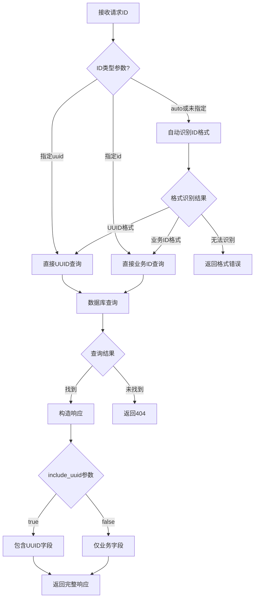

# 字段兼容性规则 - UUID与业务ID并存策略

**文档编号**: FIELD-COMPAT-2025-08-04  
**创建日期**: 2025年8月4日  
**适用范围**: CoreHR双ID系统  
**状态**: 设计阶段  

## 兼容性原则

### 核心设计理念

#### 1. 双字段并存
- **uuid字段**: 系统内部使用的UUID，保证全局唯一性
- **id字段**: 业务层面的人类可读ID，便于用户识别和操作
- **向后兼容**: V1 API的`id`字段映射到V2 API的`uuid`字段

#### 2. 渐进式迁移
- **数据层**: 两种ID同时存储和维护
- **API层**: V1和V2并行提供服务
- **客户端**: 按自己节奏选择迁移时机

#### 3. 智能识别
- **自动检测**: 根据ID格式自动识别类型
- **明确指定**: 支持通过参数明确指定ID类型
- **容错处理**: 提供友好的错误提示

## 字段映射规则

### V1到V2字段映射

#### 员工实体字段映射
```json
{
  // V1 API响应格式
  "v1_response": {
    "id": "e60891dc-7d20-444b-9002-22419238d499",  // UUID
    "employee_number": "EMP001",
    "first_name": "张",
    "last_name": "三",
    "position_id": "pos-uuid-here",     // UUID引用
    "organization_id": "org-uuid-here"  // UUID引用
  },
  
  // V2 API响应格式
  "v2_response": {
    "id": "1",                                      // 业务ID
    "uuid": "e60891dc-7d20-444b-9002-22419238d499", // 系统UUID
    "employee_number": "EMP001",                     // 保留但标记废弃
    "first_name": "张",
    "last_name": "三", 
    "position_id": "1000000",          // 业务ID引用
    "organization_id": "100000",       // 业务ID引用
    "manager_id": "2"                  // 新增管理者引用
  }
}
```

#### 组织实体字段映射
```json
{
  // V1 API响应格式
  "v1_response": {
    "id": "550e8400-e29b-41d4-a716-446655440000",  // UUID
    "name": "技术部",
    "code": "TECH",
    "level": 1,
    "parent_id": "parent-uuid-here"    // UUID引用
  },
  
  // V2 API响应格式  
  "v2_response": {
    "id": "100000",                                 // 业务ID
    "uuid": "550e8400-e29b-41d4-a716-446655440000", // 系统UUID
    "name": "技术部",
    "code": "TECH",                     // 保留但标记废弃
    "unit_type": "DEPARTMENT",          // 新增类型字段
    "level": 1,
    "parent_id": "100001",              // 业务ID引用
    "manager_id": "1"                   // 新增管理者引用
  }
}
```

## ID识别和验证规则

### ID格式识别

#### 自动识别逻辑
```javascript
function detectIdType(id) {
  // UUID格式: 8-4-4-4-12 hexadecimal
  const uuidPattern = /^[0-9a-f]{8}-[0-9a-f]{4}-[0-9a-f]{4}-[0-9a-f]{4}-[0-9a-f]{12}$/i;
  
  // 业务ID格式
  const employeeIdPattern = /^[1-9][0-9]{0,7}$/;        // 1-99999999
  const organizationIdPattern = /^[1-9][0-9]{5}$/;      // 100000-999999  
  const positionIdPattern = /^[1-9][0-9]{6}$/;          // 1000000-9999999
  
  if (uuidPattern.test(id)) {
    return 'uuid';
  } else if (employeeIdPattern.test(id)) {
    return 'employee_business_id';
  } else if (organizationIdPattern.test(id)) {
    return 'organization_business_id';
  } else if (positionIdPattern.test(id)) {
    return 'position_business_id';
  } else {
    return 'unknown';
  }
}
```

#### 验证规则表

| 实体类型 | 业务ID格式 | 示例 | 正则表达式 |
|----------|------------|------|------------|
| 员工 | 1-99999999 | "1", "12345678" | `^[1-9][0-9]{0,7}$` |
| 组织 | 100000-999999 | "100000", "555555" | `^[1-9][0-9]{5}$` |
| 职位 | 1000000-9999999 | "1000000", "5555555" | `^[1-9][0-9]{6}$` |
| UUID | 标准UUID格式 | "e60891dc-7d20-444b-9002-22419238d499" | UUID正则 |

### API参数处理

#### 查询参数增强
```yaml
# V2 API查询参数
parameters:
  - name: employee_id
    in: path
    required: true
    description: "Employee UUID or business ID"
    schema:
      type: string
      
  - name: id_type
    in: query
    description: "Specify ID type for optimization"
    required: false
    schema:
      type: string
      enum: [uuid, id, auto]
      default: auto
      
  - name: include_uuid
    in: query  
    description: "Include UUID in response"
    required: false
    schema:
      type: boolean
      default: false
```

#### 请求处理流程


## 数据存储兼容策略

### 数据库字段设计

#### PostgreSQL表结构
```sql
-- 员工表字段设计
CREATE TABLE employees (
    -- 系统字段 (主键)
    uuid UUID PRIMARY KEY DEFAULT gen_random_uuid(),
    tenant_id UUID NOT NULL,
    
    -- 业务字段 (用户友好ID)
    business_id VARCHAR(8) NOT NULL,
    
    -- 业务数据
    first_name VARCHAR(100) NOT NULL,
    last_name VARCHAR(100) NOT NULL,
    email VARCHAR(255) NOT NULL,
    phone_number VARCHAR(50),
    hire_date DATE NOT NULL,
    
    -- 关联字段 (同时支持UUID和业务ID查询)
    department_uuid UUID,
    department_business_id VARCHAR(6),
    position_uuid UUID,
    position_business_id VARCHAR(7),
    manager_uuid UUID,
    manager_business_id VARCHAR(8),
    
    -- 约束
    CONSTRAINT uk_employees_business_id_tenant UNIQUE (tenant_id, business_id),
    CONSTRAINT ck_employees_business_id_format CHECK (business_id ~ '^[1-9][0-9]{0,7}$'),
    
    -- 索引
    INDEX idx_employees_business_id (tenant_id, business_id),
    INDEX idx_employees_uuid (uuid)
);
```

#### Neo4j节点属性
```cypher
// 员工节点属性设计
CREATE (:Employee {
    uuid: "e60891dc-7d20-444b-9002-22419238d499",  // 系统UUID
    business_id: "1",                               // 业务ID
    tenant_id: "tenant-uuid",
    first_name: "张",
    last_name: "三"
    // ... 其他属性
});

// 创建双重索引
CREATE INDEX employee_uuid FOR (e:Employee) ON (e.tenant_id, e.uuid);
CREATE INDEX employee_business_id FOR (e:Employee) ON (e.tenant_id, e.business_id);
```

### 查询优化策略

#### 查询路由逻辑
```go
type QueryRouter struct {
    PostgresRepo Repository
    Neo4jRepo    Repository
}

func (r *QueryRouter) FindEmployee(tenantID, employeeID string, idType IDType) (*Employee, error) {
    switch idType {
    case IDTypeUUID:
        return r.findByUUID(tenantID, employeeID)
    case IDTypeBusiness:
        return r.findByBusinessID(tenantID, employeeID)
    case IDTypeAuto:
        detectedType := DetectIDType(employeeID)
        return r.FindEmployee(tenantID, employeeID, detectedType)
    default:
        return nil, ErrInvalidIDType
    }
}

func (r *QueryRouter) findByUUID(tenantID, uuid string) (*Employee, error) {
    // 优先使用UUID索引查询
    employee, err := r.PostgresRepo.FindByUUID(tenantID, uuid)
    if err != nil {
        return nil, err
    }
    return employee, nil
}

func (r *QueryRouter) findByBusinessID(tenantID, businessID string) (*Employee, error) {
    // 使用业务ID索引查询
    employee, err := r.PostgresRepo.FindByBusinessID(tenantID, businessID)
    if err != nil {
        return nil, err
    }
    return employee, nil
}
```

## 关联查询兼容处理

### 关联字段解析

#### 双重关联支持
```go
type EmployeeAssociation struct {
    // 部门关联
    DepartmentUUID       *string `json:"department_uuid,omitempty"`
    DepartmentBusinessID *string `json:"department_id,omitempty"`
    
    // 职位关联  
    PositionUUID       *string `json:"position_uuid,omitempty"`
    PositionBusinessID *string `json:"position_id,omitempty"`
    
    // 管理者关联
    ManagerUUID       *string `json:"manager_uuid,omitempty"`
    ManagerBusinessID *string `json:"manager_id,omitempty"`
}

func (a *EmployeeAssociation) ResolveDepartment(idType IDType) (string, error) {
    switch idType {
    case IDTypeUUID:
        if a.DepartmentUUID != nil {
            return *a.DepartmentUUID, nil
        }
        // 如果没有UUID，通过业务ID查找
        if a.DepartmentBusinessID != nil {
            return a.findUUIDByBusinessID("organization", *a.DepartmentBusinessID)
        }
    case IDTypeBusiness:
        if a.DepartmentBusinessID != nil {
            return *a.DepartmentBusinessID, nil
        }
        // 如果没有业务ID，通过UUID查找
        if a.DepartmentUUID != nil {
            return a.findBusinessIDByUUID("organization", *a.DepartmentUUID)
        }
    }
    return "", ErrAssociationNotFound
}
```

### 批量查询优化

#### 预加载策略
```go
func (r *QueryRouter) FindEmployeesWithAssociations(tenantID string, employeeIDs []string, opts QueryOptions) ([]*Employee, error) {
    // 1. 批量查询员工信息
    employees, err := r.batchFindEmployees(tenantID, employeeIDs, opts.IDType)
    if err != nil {
        return nil, err
    }
    
    // 2. 收集关联ID
    var departmentIDs, positionIDs, managerIDs []string
    for _, emp := range employees {
        if emp.DepartmentID != "" {
            departmentIDs = append(departmentIDs, emp.DepartmentID)
        }
        if emp.PositionID != "" {
            positionIDs = append(positionIDs, emp.PositionID)
        }
        if emp.ManagerID != "" {
            managerIDs = append(managerIDs, emp.ManagerID)
        }
    }
    
    // 3. 批量预加载关联数据
    if opts.IncludeAssociations {
        departments := r.batchFindOrganizations(tenantID, departmentIDs, opts.IDType)
        positions := r.batchFindPositions(tenantID, positionIDs, opts.IDType)
        managers := r.batchFindEmployees(tenantID, managerIDs, opts.IDType)
        
        // 4. 组装关联数据
        r.assembleAssociations(employees, departments, positions, managers)
    }
    
    return employees, nil
}
```

## 缓存兼容策略

### 缓存键设计

#### 双重缓存键
```go
type CacheManager struct {
    RedisClient redis.Client
}

func (c *CacheManager) GetEmployee(tenantID, employeeID string, idType IDType) (*Employee, error) {
    // 根据ID类型生成不同的缓存键
    var cacheKey string
    switch idType {
    case IDTypeUUID:
        cacheKey = fmt.Sprintf("employee:uuid:%s:%s", tenantID, employeeID)
    case IDTypeBusiness:
        cacheKey = fmt.Sprintf("employee:bid:%s:%s", tenantID, employeeID)
    }
    
    // 尝试从缓存获取
    data, err := c.RedisClient.Get(cacheKey).Result()
    if err == redis.Nil {
        return nil, ErrNotFoundInCache
    } else if err != nil {
        return nil, err
    }
    
    var employee Employee
    if err := json.Unmarshal([]byte(data), &employee); err != nil {
        return nil, err
    }
    
    return &employee, nil
}

func (c *CacheManager) SetEmployee(employee *Employee) error {
    data, err := json.Marshal(employee)
    if err != nil {
        return err
    }
    
    // 同时设置两种缓存键
    uuidKey := fmt.Sprintf("employee:uuid:%s:%s", employee.TenantID, employee.UUID)
    businessKey := fmt.Sprintf("employee:bid:%s:%s", employee.TenantID, employee.BusinessID)
    
    pipe := c.RedisClient.Pipeline()
    pipe.Set(uuidKey, data, time.Hour*24)      // 24小时过期
    pipe.Set(businessKey, data, time.Hour*24)  // 24小时过期
    
    _, err = pipe.Exec()
    return err
}
```

### 缓存同步策略

#### 数据更新时的缓存处理
```go
func (c *CacheManager) InvalidateEmployee(tenantID, uuid, businessID string) error {
    uuidKey := fmt.Sprintf("employee:uuid:%s:%s", tenantID, uuid)
    businessKey := fmt.Sprintf("employee:bid:%s:%s", tenantID, businessID)
    
    pipe := c.RedisClient.Pipeline()
    pipe.Del(uuidKey)
    pipe.Del(businessKey)
    
    _, err := pipe.Exec()
    return err
}

func (c *CacheManager) RefreshEmployee(employee *Employee) error {
    // 先删除旧缓存
    if err := c.InvalidateEmployee(employee.TenantID, employee.UUID, employee.BusinessID); err != nil {
        return err
    }
    
    // 再设置新缓存
    return c.SetEmployee(employee)
}
```

## 错误处理兼容

### 错误类型定义

#### 兼容性错误处理
```go
type CompatibilityError struct {
    Type      string      `json:"type"`
    Message   string      `json:"message"`
    Details   interface{} `json:"details"`
    RequestID string      `json:"request_id"`
    Timestamp time.Time   `json:"timestamp"`
}

// ID格式错误
type IDFormatError struct {
    Field         string `json:"field"`
    ProvidedValue string `json:"provided_value"`
    ExpectedFormat string `json:"expected_format"`
    SuggestedFix  string `json:"suggested_fix"`
}

// ID不存在错误
type IDNotFoundError struct {
    IDType string `json:"id_type"`
    ID     string `json:"id"`
    Entity string `json:"entity"`
}

func NewIDFormatError(field, value string, entityType EntityType) *CompatibilityError {
    var expectedFormat, suggestedFix string
    
    switch entityType {
    case EntityEmployee:
        expectedFormat = "1-99999999 (string format)"
        suggestedFix = "Use a number between 1 and 99999999 as a string"
    case EntityOrganization:
        expectedFormat = "100000-999999 (string format)"
        suggestedFix = "Use a number between 100000 and 999999 as a string"
    }
    
    return &CompatibilityError{
        Type:    "ID_FORMAT_ERROR",
        Message: fmt.Sprintf("Invalid %s format", field),
        Details: &IDFormatError{
            Field:          field,
            ProvidedValue:  value,
            ExpectedFormat: expectedFormat,
            SuggestedFix:   suggestedFix,
        },
        RequestID: generateRequestID(),
        Timestamp: time.Now(),
    }
}
```

### 错误响应格式

#### V2增强错误响应
```json
{
  "error": "ID_FORMAT_ERROR",
  "message": "Invalid employee_id format",
  "details": {
    "field": "employee_id",
    "provided_value": "invalid-id-123",
    "expected_format": "1-99999999 (string format) or UUID format",
    "suggested_fix": "Use a number between 1 and 99999999 as a string, or provide a valid UUID"
  },
  "validation_errors": [
    {
      "field": "employee_id",
      "message": "Must be either a valid business ID or UUID",
      "code": "INVALID_ID_FORMAT"
    }
  ],
  "timestamp": "2025-08-04T10:30:00Z",
  "request_id": "req-12345678-abcd-efgh",
  "api_version": "v2"
}
```

## 性能优化兼容

### 查询性能优化

#### 索引策略
```sql
-- 针对不同查询模式的索引优化
-- 1. UUID查询优化
CREATE INDEX CONCURRENTLY idx_employees_uuid_tenant 
ON employees (tenant_id, uuid) 
WHERE uuid IS NOT NULL;

-- 2. 业务ID查询优化  
CREATE INDEX CONCURRENTLY idx_employees_business_id_tenant
ON employees (tenant_id, business_id)
WHERE business_id IS NOT NULL;

-- 3. 关联查询优化
CREATE INDEX CONCURRENTLY idx_employees_dept_business_id
ON employees (tenant_id, department_business_id)
WHERE department_business_id IS NOT NULL;

-- 4. 复合查询优化
CREATE INDEX CONCURRENTLY idx_employees_search_v2
ON employees (tenant_id, business_id, first_name, last_name, email)
WHERE business_id IS NOT NULL;
```

#### 查询计划优化
```go
type QueryOptimizer struct {
    Stats QueryStats
}

func (o *QueryOptimizer) OptimizeEmployeeQuery(query EmployeeQuery) QueryPlan {
    plan := QueryPlan{}
    
    // 根据统计信息选择最优查询路径
    if o.Stats.BusinessIDUsageRatio > 0.7 {
        // 大多数查询使用业务ID，优先业务ID索引
        plan.PrimaryIndex = "idx_employees_business_id_tenant"
        plan.QueryType = "business_id_first"
    } else {
        // UUID使用较多，保持现有查询路径  
        plan.PrimaryIndex = "idx_employees_uuid_tenant"
        plan.QueryType = "uuid_first"
    }
    
    // 预加载优化
    if query.IncludeAssociations {
        plan.PreloadStrategy = "batch_load"
        plan.BatchSize = 50
    }
    
    return plan
}
```

## 监控和度量

### 兼容性监控指标

#### 关键指标
```go
type CompatibilityMetrics struct {
    // ID使用情况
    UUIDQueryCount      int64 `json:"uuid_query_count"`
    BusinessIDQueryCount int64 `json:"business_id_query_count"`
    AutoDetectCount     int64 `json:"auto_detect_count"`
    
    // 错误情况
    IDFormatErrors      int64 `json:"id_format_errors"`
    IDNotFoundErrors    int64 `json:"id_not_found_errors"`
    
    // 性能指标
    UUIDQueryLatency      float64 `json:"uuid_query_latency_ms"`
    BusinessIDQueryLatency float64 `json:"business_id_query_latency_ms"`
    
    // 缓存效果
    CacheHitRateUUID       float64 `json:"cache_hit_rate_uuid"`
    CacheHitRateBusinessID float64 `json:"cache_hit_rate_business_id"`
}

func (m *CompatibilityMetrics) CalculateBusinessIDAdoptionRate() float64 {
    total := m.UUIDQueryCount + m.BusinessIDQueryCount
    if total == 0 {
        return 0
    }
    return float64(m.BusinessIDQueryCount) / float64(total) * 100
}
```

---

**兼容性规则状态**: 设计完成，等待开发实现  
**下一步行动**: 后端开发团队实现评审  
**负责人**: 后端架构组  
**预计完成**: 2025年8月第2周  