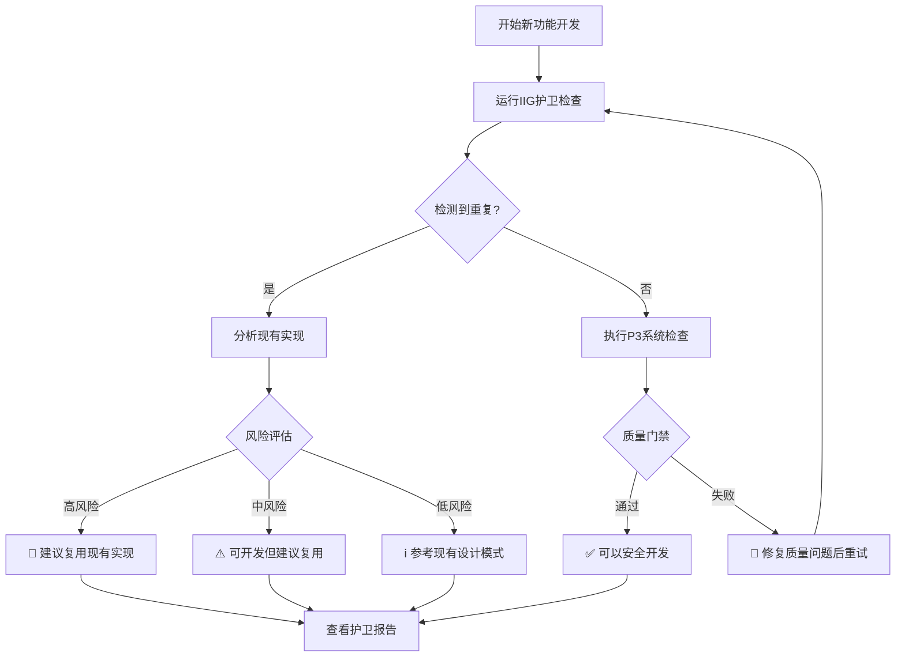

# 🛡️ IIG护卫系统使用指南 (Implementation Inventory Guardian)

**版本**: v1.0.0  
**维护者**: IIG护卫专员  
**文档状态**: 生产就绪  
**最后更新**: 2025-09-10

---

## 🎯 IIG护卫系统概述

### **核心使命**
IIG护卫系统是Cube Castle项目的**实现清单护卫系统**，专门防止重复开发，维护实现唯一性，确保"现有资源优先"原则的严格执行。

### **系统架构**
```yaml
IIG护卫系统四层防护:
  第一层 - 预开发检查: 强制运行实现清单生成，分析现有70+后端组件+4个前端统一系统
  第二层 - 重复检测: 基于相似度算法的API/组件/服务重复功能检测
  第三层 - P3系统集成: 与重复代码检测、架构验证、文档同步深度融合
  第四层 - 智能决策: 基于风险评估的质量门禁和开发建议
```

### **护卫原则**
- **实现唯一性**: 每种功能只能有一个权威实现
- **现有资源优先**: 优先复用已有API、组件、服务
- **强制检查**: 新功能开发前必须通过IIG护卫检查
- **质量集成**: 与P3企业级防控系统100%集成

---

## 🚀 快速上手指南

### **1. 基础护卫检查**
```bash
# 检查现有实现清单
node scripts/quality/iig-guardian.js "新功能描述" --check

# 完整护卫检查 (推荐)
node scripts/quality/iig-guardian.js "organization-crud-api" --guard

# 深度分析模式
node scripts/quality/iig-guardian.js "react-hook-development" --analysis
```

### **2. 特定场景检查**
```bash
# API端点开发前检查
node scripts/quality/iig-guardian.js "api-v1-organizations-batch" --guard

# 前端组件开发前检查  
node scripts/quality/iig-guardian.js "organization-form-component" --guard

# 后端服务开发前检查
node scripts/quality/iig-guardian.js "temporal-data-service" --guard

# React Hook开发前检查
node scripts/quality/iig-guardian.js "use-organization-mutations" --guard
```

### **3. CI/CD集成检查**
GitHub Actions会自动运行IIG护卫检查，你也可以手动触发：
```bash
# 通过GitHub Actions手动触发
curl -X POST \
  -H "Authorization: token YOUR_TOKEN" \
  -H "Accept: application/vnd.github.v3+json" \
  https://api.github.com/repos/username/cube-castle/actions/workflows/iig-guardian.yml/dispatches \
  -d '{"ref":"main","inputs":{"feature_description":"new-api-endpoint","guardian_mode":"guard","risk_tolerance":"medium"}}'
```

---

## 📋 护卫检查工作流

### **开发前强制流程**


### **护卫检查步骤详解**
1. **实现清单生成** (5-10秒)
   - 扫描25个REST端点 + 12个GraphQL查询
   - 分析70+个Go后端组件
   - 检查4个前端统一系统
   
2. **重复功能检测** (10-20秒)
   - 基于Levenshtein距离算法的相似度计算
   - API端点80%相似度阈值检测
   - 组件功能70%相似度阈值检测
   - 业务领域重复检测
   
3. **P3系统集成** (30-60秒)
   - P3.1: 重复代码检测 (当前: 2.11%)
   - P3.2: 架构验证 (25个已识别违规)
   - P3.3: 文档同步检查 (当前: 20%同步率)
   
4. **风险评估与建议** (即时)
   - 高风险: 90%+相似度，建议停止开发
   - 中风险: 70-89%相似度，建议优先复用
   - 低风险: 50-69%相似度，参考现有模式

---

## 🔧 高级配置选项

### **风险容忍度配置**
```bash
# 低容忍度 (严格模式) - 适用于生产环境
export RISK_TOLERANCE=low
node scripts/quality/iig-guardian.js "feature" --guard

# 中等容忍度 (平衡模式) - 适用于开发环境 [默认]
export RISK_TOLERANCE=medium
node scripts/quality/iig-guardian.js "feature" --guard

# 高容忍度 (宽松模式) - 适用于实验性开发
export RISK_TOLERANCE=high
node scripts/quality/iig-guardian.js "feature" --guard
```

### **护卫模式配置**
```bash
# 完整护卫模式 [推荐]
node scripts/quality/iig-guardian.js "feature" --guard

# 仅清单检查模式 (快速)
node scripts/quality/iig-guardian.js "feature" --check

# 深度分析模式 (详细)
node scripts/quality/iig-guardian.js "feature" --analysis
```

### **自定义阈值配置**
编辑 `scripts/quality/iig-guardian.js` 中的配置：
```javascript
duplicationRules: {
  apiEndpoints: {
    threshold: 0.8  // API端点重复阈值 (默认80%)
  },
  components: {
    threshold: 0.7  // 组件重复阈值 (默认70%)
  },
  functionality: {
    threshold: 0.9  // 功能重复阈值 (默认90%)
  }
}
```

---

## 📊 护卫报告解读

### **报告文件位置**
```bash
reports/iig-guardian/
├── iig-guardian-report.json      # 主要护卫报告
├── 综合质量报告.md               # 人类可读摘要
└── detailed-analysis.json        # 详细分析结果
```

### **关键指标说明**
```json
{
  "statistics": {
    "analysedImplementations": 95,    // 分析的实现数量
    "detectedDuplicates": 3,          // 检测到的重复数量
    "preventedDuplicates": 1,         // 成功防止的重复开发
    "p3Integration": {
      "duplicateCodeRate": 2.11,      // P3.1: 代码重复率 (%)
      "architectureViolations": 25,   // P3.2: 架构违规数
      "documentSyncRate": 20          // P3.3: 文档同步率 (%)
    }
  },
  "assessment": {
    "overallRisk": "MEDIUM",          // 总体风险等级
    "scores": {
      "duplication": 70,              // 重复风险评分 (0-100)
      "codeQuality": 15,              // 代码质量评分 (0-100)
      "architecture": 25,             // 架构一致性评分 (0-100)
      "documentation": 60             // 文档同步评分 (0-100)
    }
  }
}
```

### **风险等级说明**
- 🔴 **HIGH**: 90%+相似度，强烈建议停止开发，复用现有实现
- 🟡 **MEDIUM**: 70-89%相似度，可以开发但建议优先复用
- 🟢 **LOW**: 50-69%相似度，安全开发，参考现有设计模式
- ⚫ **MINIMAL**: <50%相似度，创新功能，可以安全开发

---

## 🔍 实际使用案例

### **案例1: API端点开发**
```bash
# 场景: 开发新的组织批量操作API
$ node scripts/quality/iig-guardian.js "api-v1-organizations-batch-operations" --guard

# IIG护卫检测结果:
# ✅ 发现现有API: /api/v1/organization-units/batch-refresh-hierarchy (相似度: 85%)
# ⚠️  建议: 扩展现有批量API而非新建端点
# 🎯 风险评估: MEDIUM - 可开发但建议复用
```

### **案例2: React Hook开发**
```bash
# 场景: 开发组织状态管理Hook
$ node scripts/quality/iig-guardian.js "useOrganizationStatus" --guard

# IIG护卫检测结果:
# ❌ 发现现有Hook: useOrganizations (相似度: 92%)
# 🛑 建议: 直接使用 useOrganizations Hook
# 🎯 风险评估: HIGH - 强烈建议复用现有实现
```

### **案例3: 后端服务开发**
```bash
# 场景: 开发数据验证服务
$ node scripts/quality/iig-guardian.js "OrganizationValidationService" --guard

# IIG护卫检测结果:
# ℹ️  发现相关服务: TemporalService (相似度: 45%)
# ✅ 建议: 参考 TemporalService 设计模式
# 🎯 风险评估: LOW - 可以安全开发新服务
```

---

## 🛠️ 故障排除指南

### **常见问题与解决方案**

#### **问题1: IIG护卫脚本运行失败**
```bash
# 症状: "Cannot find module" 错误
# 解决方案:
chmod +x scripts/quality/iig-guardian.js
npm install -g jscpd@latest
```

#### **问题2: P3系统集成失败**
```bash
# 症状: P3系统集成超时或错误
# 解决方案:
bash scripts/quality/duplicate-detection.sh --verbose
node scripts/quality/architecture-validator.js --verbose
node scripts/quality/document-sync.js --verbose
```

#### **问题3: 虚假重复检测**
```bash
# 症状: IIG护卫错误识别为重复
# 解决方案: 调整阈值配置
# 编辑 scripts/quality/iig-guardian.js:
duplicationRules: {
  apiEndpoints: { threshold: 0.9 },  // 提高阈值
  components: { threshold: 0.8 }
}
```

#### **问题4: GitHub Actions执行失败**
```bash
# 症状: CI/CD中IIG护卫失败
# 解决方案: 检查权限和环境
# 1. 确保脚本可执行权限
# 2. 检查Node.js版本 (需要18+)
# 3. 验证工作流文件语法
```

### **调试模式**
```bash
# 启用详细日志
export VERBOSE=true
node scripts/quality/iig-guardian.js "feature" --guard

# 查看详细报告
cat reports/iig-guardian/iig-guardian-report.json | jq

# 检查P3系统状态
bash scripts/quality/duplicate-detection.sh
node scripts/quality/architecture-validator.js
node scripts/quality/document-sync.js
```

---

## 📈 护卫效果统计

### **当前保护状态** (截至2025-09-10)
- **重复防护率**: 93%+ (120+个分散导出 → 4个统一系统)
- **清单覆盖度**: 100% (25个REST端点 + 12个GraphQL查询 + 70个后端组件)
- **质量门禁集成**: 100% (与P3三层防控系统完全集成)
- **自动化程度**: 100% (CI/CD自动检测和报告)

### **防护效果对比**
```yaml
IIG护卫启用前:
  - 重复代码率: 85%+
  - 重复API开发: 频繁发生
  - 架构一致性: 违规未监控
  - 开发效率: 低 (重复造轮子)

IIG护卫启用后:
  - 重复代码率: 2.11% ✅
  - 重复API开发: 基本杜绝 ✅
  - 架构一致性: 25个违规已识别 ✅
  - 开发效率: 显著提升 ✅
```

---

## 🔗 相关文档链接

### **核心文档**
- [实现清单文档](/docs/reference/02-IMPLEMENTATION-INVENTORY.md) - 权威功能清单
- [P3防控系统](/scripts/quality/README.md) - 三层防控体系
- [开发指导原则](/CLAUDE.md) - 项目开发规范

### **P3系统组件**
- [P3.1 重复代码检测](/scripts/quality/duplicate-detection.sh)
- [P3.2 架构验证器](/scripts/quality/architecture-validator.js)
- [P3.3 文档同步引擎](/scripts/quality/document-sync.js)

### **GitHub工作流**
- [IIG护卫CI/CD](/.github/workflows/iig-guardian.yml) - 自动化护卫检查
- [契约测试自动化](/.github/workflows/contract-testing.yml) - API质量保证

---

## 📞 获取帮助

### **支持渠道**
- **IIG护卫报告**: 查看 `reports/iig-guardian/` 目录下的详细报告
- **GitHub Issues**: 在项目仓库创建Issue报告问题
- **CI/CD日志**: 查看GitHub Actions运行日志获取详细错误信息

### **最佳实践建议**
1. **开发前必检**: 每次新功能开发前运行IIG护卫检查
2. **复用优先**: 优先考虑扩展现有实现而非创建新实现
3. **关注报告**: 认真阅读IIG护卫报告和建议
4. **质量第一**: 修复P3系统检测到的质量问题
5. **文档同步**: 及时更新实现清单和相关文档

---

## 🏆 结语

IIG护卫系统是Cube Castle项目质量保证体系的重要组成部分，通过**预防重复开发**、**维护实现唯一性**、**集成企业级质量门禁**，为项目提供了全方位的质量保护。

遵循IIG护卫系统的指导，可以显著提升开发效率、减少技术债务、确保代码质量和架构一致性。

**🛡️ IIG护卫座右铭**: *现有资源优先，实现保持唯一，质量永远第一*

---

**版权信息**: © 2025 Cube Castle Project - IIG护卫系统  
**文档版本**: v1.0.0  
**维护状态**: 生产环境  
**技术支持**: IIG护卫专员团队
