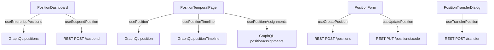

# 职位管理模块组件映射表

**版本**: v1.0
**创建日期**: 2025-10-21
**维护团队**: 前端团队
**关联计划**: 80号职位管理方案 · 107号收口差距核查报告

---

## 1. 组件层级结构

```
frontend/src/features/positions/
├── PositionDashboard.tsx          # 职位管理主仪表板（列表 + 统计）
├── PositionTemporalPage.tsx       # 职位详情页（时态版本 + Tab切换）
├── components/
│   ├── dashboard/                 # 仪表板组件
│   │   ├── PositionHeadcountDashboard.tsx   # 编制统计仪表板
│   │   ├── PositionSummaryCards.tsx         # 统计卡片组件
│   │   └── PositionVacancyBoard.tsx         # 空缺职位看板
│   ├── details/                   # 详情页组件
│   │   ├── PositionDetails.tsx              # 职位详情展示
│   │   └── PositionAssignmentHistory.tsx    # 任职历史记录
│   ├── list/                      # 列表组件
│   │   └── PositionList.tsx                 # 职位列表表格
│   ├── PositionForm/              # 表单组件
│   │   ├── index.tsx                        # 主表单组件
│   │   ├── FormFields.tsx                   # 表单字段定义
│   │   ├── validation.ts                    # 表单验证逻辑
│   │   ├── payload.ts                       # API负载转换
│   │   └── types.ts                         # 表单类型定义
│   ├── versioning/                # 版本管理组件
│   │   ├── VersionList.tsx                  # 版本列表
│   │   ├── VersionToolbar.tsx               # 版本工具栏
│   │   └── utils.ts                         # 版本工具函数
│   ├── transfer/                  # 转移操作组件
│   │   └── PositionTransferDialog.tsx       # 职位转移对话框
│   └── layout/                    # 布局组件
│       └── SimpleStack.tsx                  # 简单堆叠布局
├── hooks/                         # 业务钩子（位于 shared/hooks/）
│   ├── useEnterprisePositions.ts            # 职位查询钩子
│   ├── usePositionMutations.ts              # 职位修改钩子
│   └── usePositionCatalogOptions.ts         # 职位分类选项钩子
└── types/                         # 类型定义（位于 shared/types/）
    └── positions.ts                         # 职位类型定义
```

---

## 2. 页面路由映射

| 路由路径 | 组件 | 功能描述 | 权限要求 |
|---------|------|----------|---------|
| `/positions` | PositionDashboard | 职位管理主页（列表+统计） | `position:read` |
| `/positions/:code` | PositionTemporalPage | 职位详情（时态版本+Tab） | `position:read` |
| `/positions/headcount` | PositionHeadcountDashboard | 编制统计仪表板 | `position:read:stats` |

---

## 3. 组件功能映射

### 3.1 主页面组件

| 组件 | 职责 | 使用的Hook/API | 输出 |
|------|------|----------------|------|
| PositionDashboard | 职位列表+统计汇总 | useEnterprisePositions, useSuspendPosition | 职位列表表格+统计卡片 |
| PositionTemporalPage | 职位详情（多Tab） | usePosition, usePositionTimeline | 详情Tab+版本Tab+任职Tab+转移Tab |

### 3.2 仪表板组件

| 组件 | 职责 | GraphQL查询 | 展示内容 |
|------|------|-------------|---------|
| PositionHeadcountDashboard | 编制统计总览 | positionHeadcountStats | 按组织/职级/类型统计编制 |
| PositionSummaryCards | 统计卡片展示 | positions(filter) | 总职位数/已填充/空缺/计划中 |
| PositionVacancyBoard | 空缺职位看板 | vacantPositions | 空缺职位列表+紧急度标记 |

### 3.3 表单与操作组件

| 组件 | 职责 | REST端点 | 权限要求 |
|------|------|---------|---------|
| PositionForm | 创建/编辑职位 | POST/PUT /api/v1/positions | position:create, position:update |
| PositionTransferDialog | 职位转移对话框 | POST /api/v1/positions/{code}/transfer | position:transfer |
| VersionList | 版本历史展示 | GraphQL: positionVersions | position:read:history |
| VersionToolbar | 版本操作工具栏 | POST /api/v1/positions/{code}/versions | position:create:version |

### 3.4 详情展示组件

| 组件 | 职责 | 数据来源 | 展示内容 |
|------|------|---------|---------|
| PositionDetails | 职位基本信息展示 | GraphQL: position | 标题/组织/职位体系/编制/状态 |
| PositionAssignmentHistory | 任职历史记录 | GraphQL: positionAssignments | 员工任职时间线+填充/空缺事件 |
| PositionList | 职位列表表格 | GraphQL: positions | 分页列表+筛选+排序 |

---

## 4. 共享业务逻辑（Hooks）

| Hook | 位置 | 职责 | 底层API |
|------|------|------|---------|
| useEnterprisePositions | shared/hooks/ | 职位列表查询 | GraphQL: positions |
| usePosition | shared/hooks/ | 单个职位查询 | GraphQL: position |
| usePositionTimeline | shared/hooks/ | 职位时间线 | GraphQL: positionTimeline |
| useCreatePosition | shared/hooks/ | 创建职位 | REST: POST /positions |
| useUpdatePosition | shared/hooks/ | 更新职位 | REST: PUT /positions/{code} |
| useFillPosition | shared/hooks/ | 填充职位 | REST: POST /positions/{code}/fill |
| useVacatePosition | shared/hooks/ | 空缺职位 | REST: POST /positions/{code}/vacate |
| useTransferPosition | shared/hooks/ | 转移职位 | REST: POST /positions/{code}/transfer |
| usePositionCatalogOptions | shared/hooks/ | 职位分类选项 | GraphQL: jobFamilyGroups等 |

---

## 5. 数据流与状态管理



### 5.1 查询层（GraphQL）

- **职位列表**: `positions(filter, pagination)` → PositionDashboard, PositionList
- **职位详情**: `position(code, asOfDate)` → PositionDetails
- **时间线**: `positionTimeline(code, startDate, endDate)` → VersionList
- **任职记录**: `positionAssignments(positionCode, filter)` → PositionAssignmentHistory
- **编制统计**: `positionHeadcountStats(organizationCode)` → PositionHeadcountDashboard
- **空缺职位**: `vacantPositions(filter)` → PositionVacancyBoard

### 5.2 命令层（REST）

- **创建职位**: `POST /api/v1/positions` ← PositionForm
- **更新职位**: `PUT /api/v1/positions/{code}` ← PositionForm
- **创建版本**: `POST /api/v1/positions/{code}/versions` ← VersionToolbar
- **填充职位**: `POST /api/v1/positions/{code}/fill` ← PositionDetails
- **空缺职位**: `POST /api/v1/positions/{code}/vacate` ← PositionDetails
- **转移职位**: `POST /api/v1/positions/{code}/transfer` ← PositionTransferDialog

---

## 6. 权限映射

| 组件/功能 | 必需权限 | 降级行为 |
|----------|---------|---------|
| PositionDashboard | position:read | 显示空状态 |
| 创建职位按钮 | position:create | 按钮隐藏 |
| 编辑职位按钮 | position:update | 按钮禁用 |
| 填充职位按钮 | position:fill | 按钮隐藏 |
| 空缺职位按钮 | position:vacate | 按钮隐藏 |
| 转移职位按钮 | position:transfer | 按钮隐藏 |
| 版本历史Tab | position:read:history | Tab隐藏 |
| 编制统计 | position:read:stats | 统计卡片隐藏 |

---

## 7. 复用模式

### 7.1 与组织架构共享组件

| 共享组件 | 来源 | 复用场景 |
|---------|------|---------|
| SimpleStack | positions/layout/ | 职位+组织的简单堆叠布局 |
| StatusBadge | shared/components/ | 职位状态+组织状态展示 |
| DatePicker | @workday/canvas-kit | 生效日期选择 |
| Select | @workday/canvas-kit | 组织选择器/职位分类选择 |

### 7.2 时态管理模式复用

职位模块完全复用组织架构的时态管理模式：
- `effectiveDate` / `endDate` / `isCurrent` 字段
- 版本列表组件（VersionList）
- 时间线适配器（timelineAdapter.ts）
- 版本工具栏（VersionToolbar）

---

## 8. 测试覆盖映射

| 组件类型 | 测试文件 | 覆盖场景 |
|---------|---------|---------|
| 页面组件 | __tests__/PositionDashboard.test.tsx | Mock数据渲染+权限控制 |
| 页面组件 | __tests__/PositionTemporalPage.test.tsx | Tab切换+版本展示 |
| 仪表板 | __tests__/PositionHeadcountDashboard.test.tsx | 统计数据展示 |
| 表单 | PositionForm/__tests__/validation.test.ts | 表单验证逻辑 |
| 表单 | PositionForm/__tests__/payload.test.ts | API负载转换 |

**当前测试状态** (2025-10-21):
- 单元测试: 175 passed / 1 failed / 1 skipped
- E2E测试: 仅覆盖只读场景和页签体验，缺少完整CRUD生命周期
- 覆盖率: 未达到80%要求（见107号报告§3）

---

## 9. 性能优化点

| 组件 | 优化策略 | 预期性能 |
|------|---------|---------|
| PositionList | React Query缓存+分页 | < 200ms (1000条) |
| PositionDetails | 单条查询优化索引 | < 50ms |
| PositionHeadcountDashboard | 聚合查询缓存 | < 500ms |
| VersionList | 时间线懒加载 | < 100ms |

**当前性能状态** (2025-10-21):
- ⛔ 未执行性能基线测试，无P50/P95数据（见107号报告§2.2.2）

---

## 10. 未来扩展点

### 10.1 Stage 4+ 增强（86号计划已交付）
- ✅ Position Assignment 专用API
- ✅ 代理自动恢复
- ✅ 历史视图增强
- ✅ 跨租户验证

### 10.2 后续规划
- 多重任职（Secondary/Acting）UI
- 职位对比功能
- 编制预算管理
- 职位申请工作流

---

## 11. 技术债务与改进机会

| 类别 | 问题描述 | 优先级 | 建议动作 |
|------|---------|--------|---------|
| 测试覆盖 | E2E缺少CRUD全链路场景 | P0 | 补充 Playwright 脚本（见107号§4.3） |
| 性能 | 缺少P95指标基线 | P0 | 执行压力测试（见107号§4.2） |
| 文档 | 缺少导航结构图 | P1 | 补充Mermaid图（见本文§12） |
| 代码质量 | AuthManager测试失败 | P1 | 修复存储迁移测试 |

---

## 12. 补充：导航结构图（按107号报告要求）

详见同目录下 `position-navigation-structure.md`

---

## 13. 版本变更记录

| 版本 | 日期 | 说明 |
|------|------|------|
| v1.0 | 2025-10-21 | 初版：根据107号报告要求补充组件映射表 |

---

**维护说明**:
- 此文档为80号计划§7.4的设计物料交付，满足107号报告§4.1要求
- 组件变更时请同步更新本映射表
- 新增Hook/API时请更新§4和§5的映射关系
