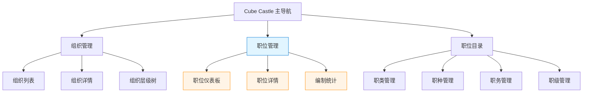
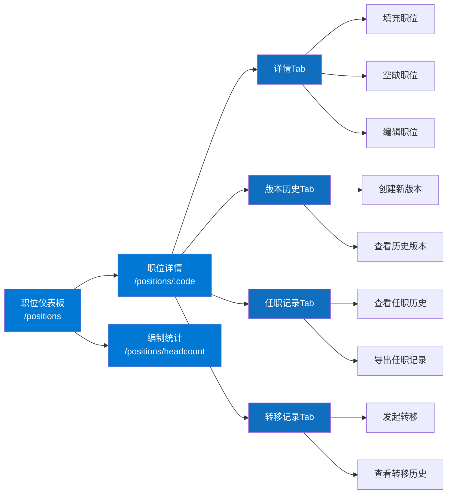
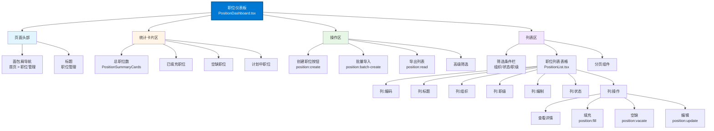
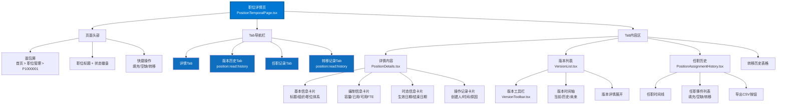
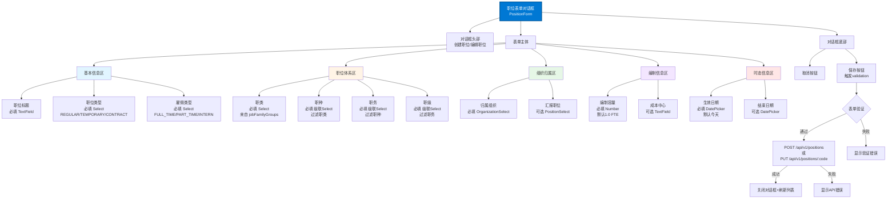
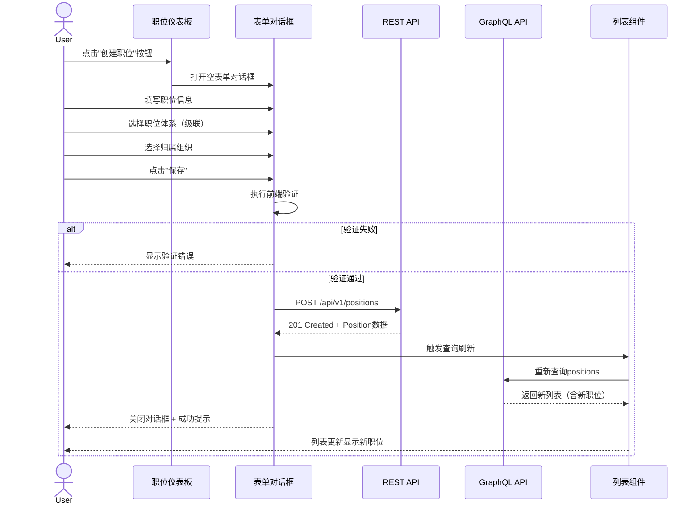
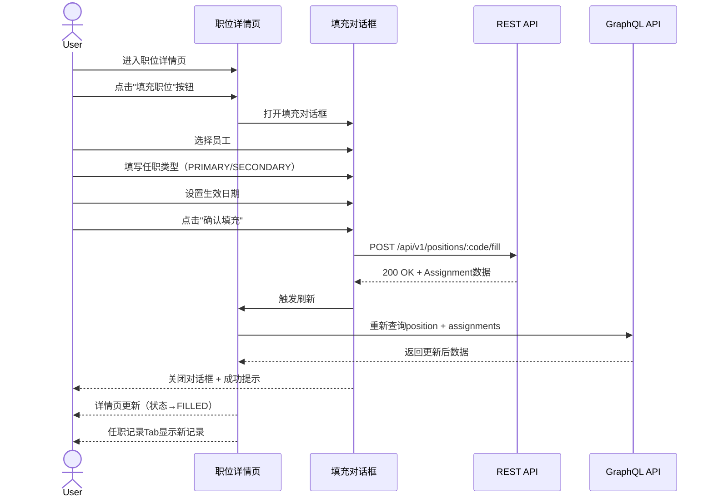
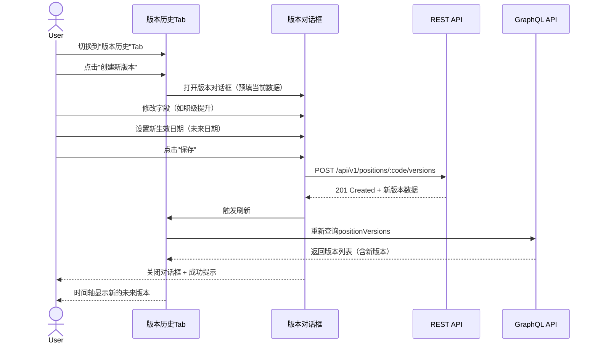
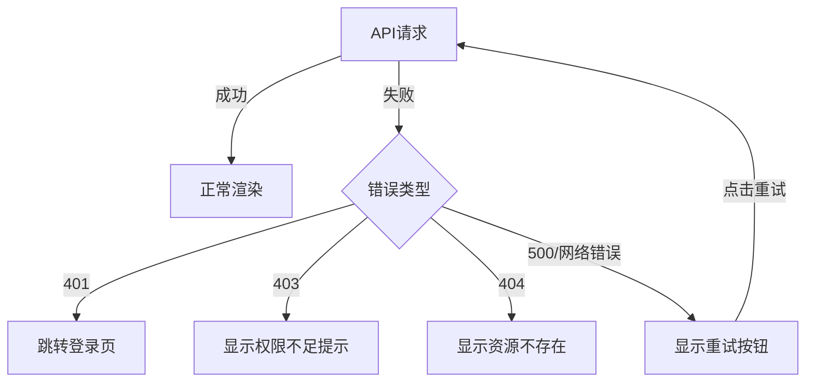

# 职位管理模块导航结构图

**版本**: v1.0
**创建日期**: 2025-10-21
**维护团队**: 前端团队 + UX团队
**关联计划**: 80号职位管理方案 · 107号收口差距核查报告

---

## 1. 系统级导航层次（3级结构）



**权限控制**:
- **职位管理** 整体需要 `position:read` 权限
- **组织管理** 需要 `org:read` 权限
- **职位目录** 需要 `job-catalog:read` 权限

---

## 2. 职位管理模块导航结构（L2: 页面级）



**路由权限映射**:
| 路由 | 组件 | 权限 | 降级行为 |
|------|------|------|---------|
| `/positions` | PositionDashboard | `position:read` | 显示空状态 |
| `/positions/:code` | PositionTemporalPage | `position:read` | 404错误 |
| `/positions/headcount` | PositionHeadcountDashboard | `position:read:stats` | 显示"无权限"提示 |

---

## 3. 职位仪表板页面结构（L3: 组件级）



**布局说明**:
- 页面宽度：固定容器（max-width: 1200px）
- 网格系统：12列栅格
- 统计卡片：4列布局（每卡3格）
- 列表区：全宽12列

---

## 4. 职位详情页面结构（L3: Tab级）



**Tab切换逻辑**:
- 默认Tab: 详情Tab
- Tab状态: URL hash控制 (`#details`, `#versions`, `#assignments`, `#transfers`)
- 权限缺失: Tab自动隐藏（如无 `position:read:history` 则隐藏版本Tab）

---

## 5. 职位表单对话框结构（L3: 表单级）



**表单验证规则**:
| 字段 | 规则 | 错误提示 |
|------|------|---------|
| title | 非空, ≤255字符 | "职位标题为必填项，最多255字符" |
| organizationCode | 非空, 7位数字格式 | "归属组织为必填项" |
| job*Code | 非空, 符合编码规则 | "职位体系分类为必填项" |
| headcountCapacity | 非空, ≥0, ≤999.99 | "编制容量必须为0-999.99之间的数字" |
| effectiveDate | 非空, ≥今天（创建时） | "生效日期为必填项" |
| endDate | 可空, >effectiveDate | "结束日期必须晚于生效日期" |

---

## 6. 用户交互流程图（E2E场景）

### 6.1 创建职位流程



### 6.2 填充职位流程



### 6.3 创建版本流程



---

## 7. 面包屑导航路径

| 页面 | 面包屑路径 | 可点击节点 |
|------|-----------|-----------|
| 职位仪表板 | 首页 > 职位管理 | 首页 |
| 职位详情 | 首页 > 职位管理 > P1000001 | 首页, 职位管理 |
| 编制统计 | 首页 > 职位管理 > 编制统计 | 首页, 职位管理 |
| 职位详情-版本Tab | 首页 > 职位管理 > P1000001 > 版本历史 | 首页, 职位管理, P1000001 |
| 职位详情-任职Tab | 首页 > 职位管理 > P1000001 > 任职记录 | 首页, 职位管理, P1000001 |

**实现方式**: 使用 Canvas Kit 的 `Breadcrumbs` 组件 + React Router 的 `useLocation` Hook

---

## 8. 移动端响应式导航（未实施）

> **注意**: 当前版本（Stage 4）仅支持桌面端（≥1024px），移动端自适应计划在后续阶段实施。

**规划中的移动端导航**:
- 汉堡菜单（Hamburger Menu）替代顶部导航
- 底部Tab Bar替代详情页多Tab
- 抽屉式筛选面板
- 简化版列表卡片

---

## 9. 键盘导航与无障碍访问

| 快捷键 | 功能 | 页面 |
|--------|------|------|
| `Ctrl+K` | 全局搜索职位 | 全局 |
| `Ctrl+N` | 创建新职位 | 仪表板 |
| `Ctrl+E` | 编辑当前职位 | 详情页 |
| `Ctrl+S` | 保存表单 | 表单对话框 |
| `Esc` | 关闭对话框 | 所有对话框 |
| `Tab` | 焦点移动 | 所有页面 |
| `1/2/3/4` | 切换Tab | 详情页（焦点在Tab栏时） |

**无障碍支持**:
- ✅ ARIA 标签完整性
- ✅ 键盘焦点管理
- ✅ 屏幕阅读器支持
- ⏳ 高对比度主题（计划中）

---

## 10. 导航性能优化

### 10.1 代码分割（Code Splitting）

```typescript
// 懒加载职位模块
const PositionDashboard = lazy(() => import('./features/positions/PositionDashboard'));
const PositionTemporalPage = lazy(() => import('./features/positions/PositionTemporalPage'));

// 路由配置
<Route path="/positions" element={<Suspense fallback={<LoadingSpinner />}><PositionDashboard /></Suspense>} />
```

### 10.2 预加载策略

- **关键路径**: 职位仪表板在首屏加载时预加载
- **非关键路径**: 详情页在用户hover列表行时预加载
- **低优先级**: 编制统计页按需加载

### 10.3 缓存策略

| 数据类型 | 缓存时间 | 失效条件 |
|---------|---------|---------|
| 职位列表 | 5分钟 | 创建/更新/删除操作 |
| 职位详情 | 10分钟 | 编辑操作 |
| 职位体系选项 | 1小时 | 手动刷新 |
| 编制统计 | 15分钟 | 填充/空缺操作 |

---

## 11. 错误处理与降级方案

### 11.1 网络错误



### 11.2 权限降级

- **缺少 `position:read`**: 显示空状态 + "无权限访问"提示
- **缺少 `position:create`**: 隐藏"创建职位"按钮
- **缺少 `position:read:history`**: 隐藏"版本历史"Tab

---

## 12. 导航埋点与分析

### 12.1 关键埋点事件

| 事件名称 | 触发时机 | 参数 |
|---------|---------|------|
| `position_list_view` | 进入职位仪表板 | userId, tenantId, timestamp |
| `position_detail_view` | 进入职位详情 | positionCode, userId |
| `position_create_click` | 点击创建按钮 | userId |
| `position_fill_success` | 填充职位成功 | positionCode, assignmentId |
| `position_tab_switch` | 切换详情页Tab | positionCode, tabName |

### 12.2 性能监控指标

- **页面加载时间**: 目标 < 2s（P95）
- **Tab切换延迟**: 目标 < 300ms
- **表单提交响应**: 目标 < 1s

---

## 13. 与80号方案对应关系

| 80号方案章节 | 导航结构对应 | 完成状态 |
|-------------|-------------|---------|
| §7.0 Stage 0 | 页面布局设计 | ✅ 已验收 |
| §7.2 Stage 1 | 核心CRUD路由 | ✅ 已完成 |
| §7.3 Stage 2 | 职位生命周期流程图 | ✅ 已完成 |
| §7.4 Stage 3 | 编制统计页面 | ✅ 已完成 |
| §7.5 Stage 4 | 任职记录Tab+流程 | ✅ 已完成（86号计划） |

---

## 14. 改进建议（基于107号报告）

| 改进点 | 当前问题 | 建议方案 | 优先级 |
|--------|---------|---------|--------|
| E2E测试覆盖 | 仅有只读场景 | 补充完整CRUD生命周期脚本 | P0 |
| 性能基线 | 无P95数据 | 执行压力测试并记录 | P0 |
| 移动端支持 | 仅支持桌面端 | 实施响应式导航 | P2 |
| 离线模式 | 不支持离线 | Service Worker缓存 | P3 |

---

## 15. 版本变更记录

| 版本 | 日期 | 说明 |
|------|------|------|
| v1.0 | 2025-10-21 | 初版：根据107号报告要求补充导航结构图 |

---

**维护说明**:
- 此文档为80号计划§7.4的设计物料交付，满足107号报告§4.1要求
- 导航变更时请同步更新Mermaid图和路由映射表
- 新增页面时请更新§2的导航结构图
